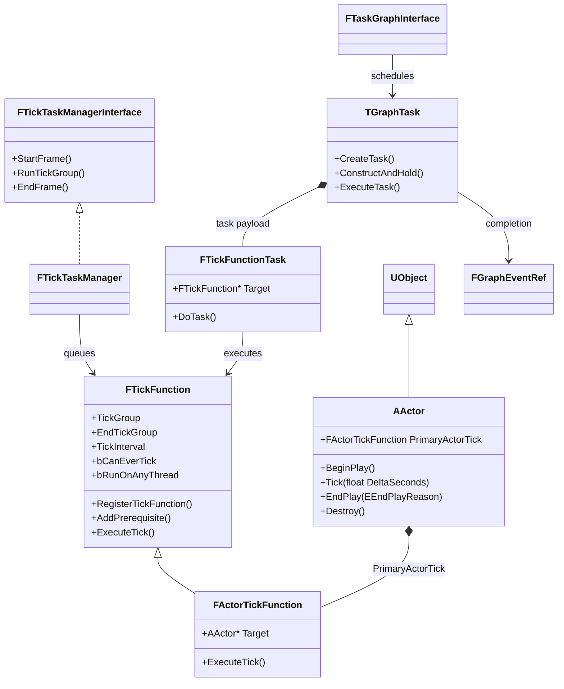
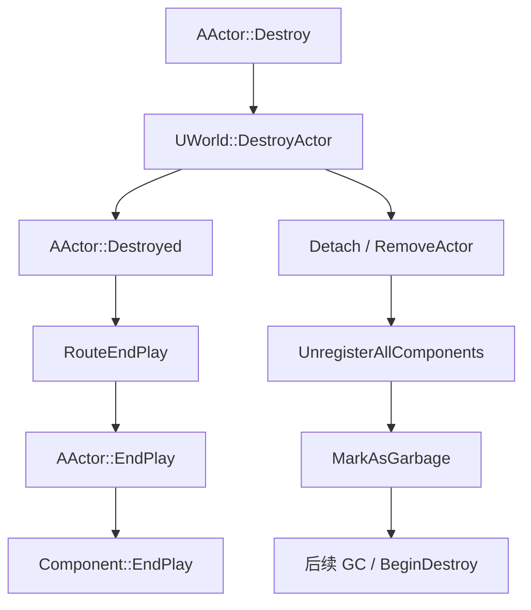

# 从 Actor 生命周期到 TaskGraph：UE 5.5 Tick 调度源码学习

> 源码版本：Unreal Engine 5.5
> 研究范围：`Runtime/Engine` 与 `Runtime/Core`
> 项目案例：`fpstrue_safe2`

## 1. 为什么从 Actor Tick 切入 Core 和 Engine

直接阅读 Core 容易陷入容器、内存、线程和平台适配的细节，直接阅读 Engine 又容易只停留在 `BeginPlay()`、`Tick()` 这些熟悉的接口。Actor Tick 正好连接了两个模块：

- Engine 定义 Actor、TickFunction、TickGroup、World 和 Level 的游戏语义。
- Core 提供 TaskGraph、线程标识、任务依赖和完成事件。

因此，Actor 的 `Tick()` 并不是 `UWorld` 简单遍历数组后逐个调用。更接近真实情况的描述是：Engine 在每帧开始时收集已注册的 `FTickFunction`，根据 TickGroup 和前置依赖建立任务，再交给 Core 的任务系统执行。

这条调用链也能解释项目里的几个实际问题：

- `PrimaryActorTick.bCanEverTick = false` 到底省掉了什么。
- Timer 为什么不是独立线程，也不是绝对准时的调度器。
- AI 决策适合低频 Timer，而 CharacterMovement 仍需要连续更新的原因。
- 为什么死亡和 EndPlay 阶段必须清理 Timer、委托和外部引用。

## 2. 模块边界

### 2.1 Core

Core 不认识 Actor 和关卡。本文使用的 Core 能力主要是：

- `ENamedThreads`：描述 GameThread、RenderingThread、AnyThread 以及任务优先级。
- `FTaskGraphInterface`：任务图调度接口。
- `TGraphTask<TTask>`：把一个任务对象包装成可以进入任务图的节点。
- `FGraphEventRef`：表示任务完成事件，也用作后续任务的前置依赖。

### 2.2 Engine

Engine 在 Core 之上定义游戏世界与 Tick 规则：

- `AActor` 持有 `FActorTickFunction PrimaryActorTick`。
- `FTickFunction` 保存 TickGroup、TickInterval、启用状态和前置依赖。
- `FTickTaskManager` 收集并调度 World 内的 TickFunction。
- `UWorld` 按 TickGroup 推进一帧。

需要特别注意：`FTickFunction` 虽然最终会进入 Core 的 TaskGraph，但它本身属于 Engine，并不是 Core 类型。

## 3. 类关系



这个关系里最重要的不是继承，而是两次包装：

1. `AActor` 的每帧更新能力被包装为 `FActorTickFunction`。
2. `FActorTickFunction` 又被包装进 `TGraphTask<FTickFunctionTask>`。

Actor 因此不需要理解线程池、完成事件和任务依赖，Core 也不需要理解 Actor 的游戏语义。

## 4. Actor 生命周期

### 4.1 构造函数不等于游戏开始

Actor 构造函数主要负责默认值和默认子对象。构造函数还会参与 CDO 和实例构造，所以不应该在这里访问依赖 World 状态的玩法对象。

本项目中的正确用法包括：

```cpp
PrimaryActorTick.bCanEverTick = false;
HealthComponent = CreateDefaultSubobject<UfpstrueHealthComponent>(TEXT("HealthComponent"));
```

目标搜索、动态生成、Timer 启动和 UI 通知更适合放在组件初始化完成后或 `BeginPlay()` 中。

### 4.2 运行时 Spawn 路径

`UWorld::SpawnActor()` 在 `LevelActor.cpp` 中调用 `NewObject<AActor>()` 创建对象，把 Actor 加入 Level，然后进入 `PostSpawnInitialize()`。

```mermaid
sequenceDiagram
    participant World as UWorld
    participant Actor as AActor
    participant Components as Actor Components

    World->>Actor: NewObject
    World->>Actor: PostSpawnInitialize
    Actor->>Components: OnComponentCreated / Register
    Actor->>Actor: PostActorCreated
    Actor->>Actor: FinishSpawning
    Actor->>Actor: ExecuteConstruction
    Actor->>Actor: PostActorConstruction
    Actor->>Actor: PreInitializeComponents
    Actor->>Components: InitializeComponents
    Actor->>Actor: PostInitializeComponents
    Actor->>Actor: DispatchBeginPlay
    Actor->>Actor: BeginPlay
    Actor->>Components: Component BeginPlay
```

几个关键结论：

1. `PostSpawnInitialize()` 会先处理 Owner、Instigator、Transform 和默认组件注册。
2. 非延迟生成会直接调用 `FinishSpawning()`；延迟生成要由调用者随后显式完成。
3. Construction Script 结束后，才能认为蓝图组件层级已经组装完成。
4. World 已完成 Actor 初始化时，动态 Spawn 的 Actor会继续执行组件初始化与 BeginPlay。

因此，使用 `SpawnActorDeferred()` 的价值不只是“晚一点生成”，而是在 Construction Script 和最终初始化前提供一次安全的参数注入机会。

### 4.3 关卡预放置 Actor 路径

关卡中的 Actor 已经随 Level 加载存在，不会重新走一遍运行时 `SpawnActor()`。World 进入 Play 时调用：

```text
UWorld::InitializeActorsForPlay
└── ULevel::RouteActorInitialize
    ├── PreInitializeComponents
    ├── InitializeComponents
    ├── PostInitializeComponents
    └── DispatchBeginPlay
```

`ULevel::RouteActorInitialize()` 使用状态分段处理初始化。源码注释还指出，PreInitialize 阶段可能生成新 Actor，因此它会持续处理，直到 Actor 数量稳定。

这说明“场景 Actor”和“运行时 Spawn Actor”前半段路径不同，但都会在组件初始化、`DispatchBeginPlay()` 和 `BeginPlay()` 附近汇合。

### 4.4 BeginPlay 是生命周期和 Tick 的连接点

`AActor::DispatchBeginPlay()` 维护 `BeginningPlay` 状态，调用真正的 `BeginPlay()`，并处理 BeginPlay 期间请求销毁的特殊情况。

`AActor::BeginPlay()` 中有两个与 Tick 直接相关的动作：

```text
RegisterAllActorTickFunctions(true, false)
RegisterAllComponentTickFunctions(true)
```

也就是说，设置 `bCanEverTick` 只是声明能力；Actor 真正进入 Play 后，PrimaryActorTick 才会注册到 TickTaskManager。

这也解释了为什么漏掉 `Super::BeginPlay()` 会造成难以理解的问题：父类不只是执行一个空回调，它还负责 Tick 注册、组件 BeginPlay 和生命周期状态推进。

### 4.5 Destroy、EndPlay 和 GC 不是一件事

玩法代码调用 `AActor::Destroy()` 后，Actor 并不是立刻执行 C++ `delete`。



源码中的语义边界是：

- `EndPlay()`：停止玩法生命周期，清理 Timer、委托和外部系统注册。
- `Destroyed()`：Actor 被 World 主动销毁时的通知入口。
- `MarkAsGarbage()`：允许 GC 在之后回收对象。
- `BeginDestroy()`：UObject 销毁阶段，不适合承担依赖正常 World 状态的玩法清理。

所以本项目在 `EndPlay()` 或死亡入口清理 Timer 是正确方向。把这些清理拖到析构函数或 `BeginDestroy()` 通常太晚。

## 5. Actor Tick 如何注册

### 5.1 PrimaryActorTick 是配置和状态载体

`FTickFunction` 保存：

- `TickGroup` 与 `EndTickGroup`
- `bCanEverTick`
- `bStartWithTickEnabled`
- `bRunOnAnyThread`
- `TickInterval`
- `Prerequisites`

`AActor::RegisterActorTickFunctions()` 只有在 `bCanEverTick` 为 true 时，才设置 Target、启用状态并调用：

```text
PrimaryActorTick.RegisterTickFunction(GetLevel())
```

`FTickFunction::RegisterTickFunction()` 最终把 TickFunction 添加进对应 Level 的 TickTaskLevel。

因此：

> `bCanEverTick = false` 不只是让 `Tick()` 里少执行一次 if，而是让这个 PrimaryActorTick 根本不进入正常注册和每帧排队流程。

组件仍有自己的 TickFunction。关闭 Actor Tick 不等于自动关闭 CharacterMovement、SkeletalMesh 或其他组件的 Tick。

### 5.2 Enabled 和 Interval 是另外两层控制

- `bCanEverTick`：是否具备并注册 Tick 的能力，通常在默认值中决定。
- `SetActorTickEnabled()`：运行时启停已存在的 TickFunction。
- `TickInterval`：仍使用 Tick 系统，但按冷却间隔重新调度。

这三者的成本和语义不同，不能都概括为“关闭 Tick”。

## 6. 一帧中的 TickGroup

`UWorld::Tick()` 在 `LevelTick.cpp` 中按阶段推进。省略网络、流送和编辑器逻辑后，主干顺序是：

```text
FTickTaskManager::StartFrame
TG_PrePhysics
TG_StartPhysics
TG_DuringPhysics
TG_EndPhysics
TG_PostPhysics
LatentAction / TimerManager / TickableGameObject
Camera Update
TG_PostUpdateWork
TG_LastDemotable
FTickTaskManager::EndFrame
```

TimerManager 在当前 UE 5.5 源码中位于 `TG_PostPhysics` 之后、`TG_PostUpdateWork` 之前。这意味着 Timer 回调观察到的世界状态和一个 `TG_PrePhysics` Actor Tick 不在同一阶段。

### 6.1 TickGroup 只规定阶段

两个 TickFunction 都属于 `TG_PrePhysics`，不代表它们之间有稳定先后顺序。如果 B 必须读取 A 本帧更新后的结果，应建立前置依赖，而不是依赖偶然的数组顺序。

### 6.2 Prerequisite 会改变实际 TickGroup

`FTickFunction::QueueTickFunction()` 会递归处理前置 TickFunction，并计算：

```text
ActualTickGroup = Max(
    PrerequisiteTickGroup,
    DesiredTickGroup,
    CurrentWorldTickGroup
)
```

如果前置任务更晚，当前任务会被推迟到允许执行的组。TickGroup 提供粗粒度阶段，`FGraphEvent` 提供任务级依赖。

## 7. 从 Engine 进入 Core TaskGraph

### 7.1 StartFrame 收集 TickFunction

`FTickTaskManager::StartFrame()` 设置 World、DeltaSeconds、TickType 和 GameThread 上下文，然后遍历 Level：

```text
Level TickTaskLevel::StartFrame
→ QueueAllTicks
→ FTickFunction::QueueTickFunction
```

UE 5.5 中并发排队默认关闭，因为源码明确指出它可能改变 Tick 排队顺序。这个细节说明“并发更多”并不自动等于“行为完全相同”。

### 7.2 TickFunction 被包装为任务

普通 TickFunction 进入 `QueueTickTask()` 后执行：

```cpp
TGraphTask<FTickFunctionTask>::CreateTask(Prerequisites, ENamedThreads::GameThread)
    .ConstructAndHold(TickFunction, &UseContext);
```

`FTickFunctionTask` 保存目标 TickFunction 和 Tick 上下文。真正执行时：

```text
FTickFunctionTask::DoTask
→ FTickFunction::ExecuteTick
→ FActorTickFunction::ExecuteTick
→ AActor::TickActor
→ AActor::Tick
```

`FActorTickFunction::ExecuteTick()` 还会检查 Target 是否有效，并把 `CustomTimeDilation` 乘到 DeltaTime 上。

### 7.3 Core 如何表达依赖

Core 中的 `TGraphTask` 接收 `FGraphEventArray` 作为 Prerequisites。创建任务时，这些完成事件决定任务何时具备执行资格。

`FGraphEventRef` 在这里有两个作用：

1. 表示当前 Tick 任务完成。
2. 成为其他 Tick 任务的前置条件。

这就是 Tick 前置关系能够形成有向任务图的原因。

### 7.4 任务在哪个线程执行

`ENamedThreads` 同时编码线程、线程优先级和任务优先级。TickTaskManager 的选择逻辑是：

- `bRunOnAnyThread == false`：默认在 GameThread 执行。
- `bRunOnAnyThread == true`：可按配置进入任务线程。
- `bHighPriority == true`：提高同类任务优先级，但不等于修改业务依赖。

把 Tick 放到 AnyThread 之前，必须确保访问的数据满足线程安全要求。大部分 Actor、Component 和 UObject 玩法 API 默认仍应视为 GameThread API。

### 7.5 UE 5.5 的兼容层

UE 5.5 的 `TGraphTask` 外观仍是传统 TaskGraph API，但启用新前端时，内部会把 `ENamedThreads` 优先级翻译到 `UE::Tasks`，再通过新的任务基类执行。

这说明引擎演进时保留了稳定调用面：Engine 的 TickTaskManager 不需要一次性改写所有调用代码，Core 可以逐步替换任务系统内部实现。

## 8. Tick 调用时序

```mermaid
sequenceDiagram
    participant World as UWorld::Tick
    participant Manager as FTickTaskManager
    participant TickFn as FTickFunction
    participant Graph as Core TGraphTask
    participant ActorTick as FActorTickFunction
    participant Actor as AActor

    World->>Manager: StartFrame
    Manager->>TickFn: QueueTickFunction
    TickFn->>TickFn: resolve prerequisites and ActualTickGroup
    TickFn->>Graph: CreateTask(PrerequisiteEvents)
    World->>Manager: RunTickGroup
    Manager->>Graph: release eligible tasks
    Graph->>TickFn: FTickFunctionTask::DoTask
    TickFn->>ActorTick: ExecuteTick
    ActorTick->>Actor: TickActor
    Actor->>Actor: Tick
    Graph-->>Manager: FGraphEvent completed
    World->>Manager: EndFrame
```

## 9. Timer 与 Tick 的真实关系

`FTimerManager::Tick()` 由 `UWorld::Tick()` 每帧调用。TimerManager 增加内部时间，检查按过期时间组织的活动 Timer，并执行已经到期的委托。

所以 Timer 有三个重要性质：

1. Timer 不是独立线程，普通 Timer 委托仍在 World Tick 流程中执行。
2. Timer 不能保证在物理时间点上绝对准时，只能在某一帧发现已经到期后执行。
3. Timer 适合表达低频业务调度和延迟动作，但不自动适合高频连续运动。

从成本角度看，把 50 个敌人的复杂 AI 判断放进每帧 Tick，会同时产生 Tick 排队成本和 50 份业务计算。改成 0.1 到 0.3 秒的决策 Timer 后，核心收益通常来自**降低业务决策频率**，而不只是把 API 名字从 Tick 换成 Timer。

## 10. fpstrue 项目对照

### 10.1 玩家 Character

`AfpstrueCharacter` 当前设置：

```cpp
PrimaryActorTick.bCanEverTick = true;
```

Tick 中调用 `UpdateCharacterState()`。玩家数量只有一个，这个成本不大，但状态更新如果完全由输入、移动模式和动画事件驱动，就有继续移除 Character Tick 的空间。

结论不是“玩家 Tick 一定错误”，而是要检查它是否承担必须逐帧计算的内容。

### 10.2 EnemyCharacter

`AfpstrueEnemyCharacter` 明确关闭 Actor Tick：

```cpp
PrimaryActorTick.bCanEverTick = false;
```

近战命中连续采样由 AnimNotifyState 驱动，攻击结束使用 Timer 兜底。移动连续性由 CharacterMovement 与 AI MoveTo 处理，因此 EnemyCharacter 自己不需要再做一份逐帧追击判断。

### 10.3 EnemyAIController

AIController 同样关闭 Tick，通过 `DecisionTimerHandle` 调用 `UpdateAI()`。这把“每帧感知和决策”改成“按状态安排下一次决策”。

这个设计适合当前丧尸玩法，因为：

- 目标通常是唯一玩家。
- 追击路径由导航系统持续执行。
- Attack、Chase、Dead 不需要每帧重新做完整状态选择。

但 Timer 频率不能无限降低。决策间隔直接构成 AI 响应延迟上限，需要在 CPU 成本和手感之间测量。

### 10.4 SurroundManager 与 GameMode

- SurroundManager 关闭 Tick，只有调试槽位显示按低频 Timer 刷新。
- GameMode 用 1 秒循环 Timer 推进倒计时，用一次性 Timer 控制波次间隔。

这些逻辑本身就是离散事件，没有理由进入每帧 Actor Tick。

### 10.5 生命周期治理

当前代码已经出现正确的清理模式：

- SurroundManager 在 `EndPlay()` 清理调试 Timer。
- GameMode 集中清理倒计时、波次和性能采集 Timer。
- Enemy 死亡时停止 AI、清理攻击 Timer、停止移动并关闭碰撞。

仍需继续治理的地方是：攻击和换弹的正常结束应由 Montage/Notify 生命周期确认，Timer 更适合作为超时兜底。否则动画被打断后，Timer 仍可能提交一个已经过期的状态转换。

## 11. 性能验证方案

仅凭“关闭了 Tick”不能证明优化有效，建议保留以下实验：

| 场景 | 数量 | AI 方式 | 记录指标 |
| --- | ---: | --- | --- |
| 基线 | 10/25/50 | Timer FSM | Game Thread、AI Decision Count、Move Request Count |
| 对照 A | 10/25/50 | 每帧完整决策 | Game Thread 与 Tick 排队时间 |
| 对照 B | 10/25/50 | 不同 Timer 间隔 | CPU 与攻击响应延迟 |

工具与命令：

```text
stat game
stat taskgraph
stat fpstruePerformance
Unreal Insights
```

重点关注：

- `FTickTaskManager::StartFrame` 的 Queue Ticks 时间。
- Tick 数量和 TickGroup 等待时间。
- `STAT_fpstrueAIDecisionTime` 与 Decision Count。
- `STAT_fpstrueAIMoveRequestCount` 是否因重复 MoveTo 过高。
- 50 个敌人时响应延迟是否还能接受。

## 12. 容易写错的结论

### 12.1 “Tick 都在 GameThread 顺序执行”

不完整。默认 Actor Tick 通常在 GameThread，但 `bRunOnAnyThread` 允许 TickFunction 进入任务线程，任务之间还可能通过完成事件建立依赖。

### 12.2 “设置 TickGroup 就能保证两个 Actor 的先后顺序”

不准确。TickGroup 只提供阶段边界。同组严格依赖应使用 Prerequisite。

### 12.3 “Timer 比 Tick 快”

不准确。Timer 仍由 World 每帧推进。它的主要价值是降低业务执行频率、集中管理延迟行为和表达离散时间语义。

### 12.4 “Destroy 后对象立刻消失”

不准确。Actor 先退出玩法生命周期、从 World 移除并标记为垃圾，内存回收由之后的 GC 完成。

### 12.5 “关闭 Actor Tick 就没有任何逐帧成本”

不准确。Actor 的组件、动画、CharacterMovement、导航和物理仍可能更新。优化必须按系统拆解，不能只看 Actor 的 `Tick()`。

## 13. 我的理解

读完这条调用链后，我对 Tick 的理解从“每帧回调”变成了“由生命周期注册、由 World 分阶段释放、由任务图表达依赖的调度单元”。

这会改变实际编码方式：

1. 首先判断逻辑是连续模拟还是离散事件。
2. 连续模拟再决定 TickGroup、执行频率和依赖。
3. 离散事件优先用输入、委托、Notify、Timer 或状态转换触发。
4. 生命周期结束时清理的不是一个函数，而是 Actor 对 Timer、委托、AI、导航和管理器的全部外部关系。

对于当前 FPS，敌人不使用 Actor Tick 并不意味着 AI 不再更新，而是把职责拆给更合适的系统：Timer 决定何时思考，NavMesh 和 MoveTo 负责持续移动，Montage Notify 决定攻击生效窗口，HealthComponent 和 Delegate 传播伤害与死亡。

这比简单地把全部逻辑塞进 Tick 更容易测量，也更容易在对象死亡或波次结束时完整停止。

## 14. 源码索引

| 内容 | 文件 | UE 5.5 位置 |
| --- | --- | ---: |
| SpawnActor 创建对象 | `Engine/Private/LevelActor.cpp` | 657 |
| 进入 PostSpawnInitialize | `Engine/Private/LevelActor.cpp` | 733 |
| PostSpawnInitialize | `Engine/Private/Actor.cpp` | 3822 |
| FinishSpawning | `Engine/Private/Actor.cpp` | 3920 |
| PostActorConstruction | `Engine/Private/Actor.cpp` | 3974 |
| World 初始化 Actor | `Engine/Private/World.cpp` | 5215 |
| Level 分阶段初始化 | `Engine/Private/Level.cpp` | 3484 |
| DispatchBeginPlay | `Engine/Private/Actor.cpp` | 4264 |
| BeginPlay 注册 Tick | `Engine/Private/Actor.cpp` | 4304 |
| 注册 Actor TickFunction | `Engine/Private/Actor.cpp` | 1322 |
| TickFunction 配置 | `Engine/Classes/Engine/EngineBaseTypes.h` | 167 |
| UWorld 每帧入口 | `Engine/Private/LevelTick.cpp` | 1259 |
| TickTaskManager StartFrame | `Engine/Private/TickTaskManager.cpp` | 1752 |
| Tick 前置依赖与实际 TickGroup | `Engine/Private/TickTaskManager.cpp` | 2307 |
| 包装为 TGraphTask | `Engine/Private/TickTaskManager.cpp` | 753 |
| Tick 任务执行 | `Engine/Private/TickTaskManager.cpp` | 260 |
| FActorTickFunction 执行 | `Engine/Private/Actor.cpp` | 277 |
| Core 线程标识 | `Core/Public/Async/TaskGraphInterfaces.h` | 53 |
| Core TaskGraph 接口 | `Core/Public/Async/TaskGraphInterfaces.h` | 273 |
| TGraphTask 新前端实现 | `Core/Public/Async/TaskGraphInterfaces.h` | 551 |
| TimerManager 执行 | `Engine/Private/TimerManager.cpp` | 911 |
| TimerManager 在帧中的位置 | `Engine/Private/LevelTick.cpp` | 1555 |
| Actor EndPlay | `Engine/Private/Actor.cpp` | 2824 |
| World 销毁 Actor | `Engine/Private/LevelActor.cpp` | 807 |
| MarkAsGarbage | `Engine/Private/LevelActor.cpp` | 1008 |
| UObject BeginDestroy | `Engine/Private/Actor.cpp` | 796 |
