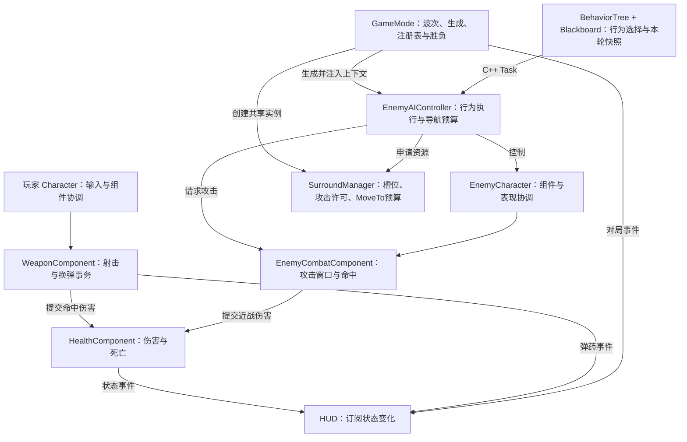
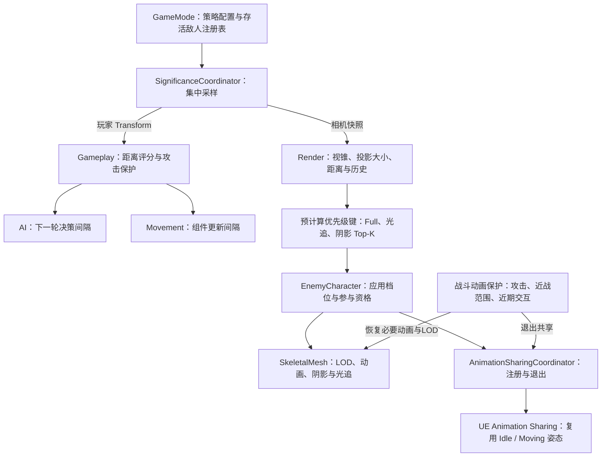

# fpstrue · UE5 C++ FPS

基于 Unreal Engine 5.5 和 C++ 的单机 PvE FPS Demo，实现射击、换弹、敌人追击与近战、群体围攻、波次结算和事件驱动 HUD 接口，并围绕 160 敌人场景开展性能分析与优化。

项目重点是完整玩法实现、多敌人更新调度，以及从实验数据追到线程依赖的性能归因。

> 本仓库提供源码、配置、测试脚本和性能记录。地图、模型、动画、音频等二进制及第三方 Content 资产不随仓库分发；还原完整关卡需要配置对应资源。

## 项目亮点

- **组件化玩法**：角色负责输入与组件协调，武器维护射击和换弹事务，生命组件统一处理伤害与死亡，敌人 CombatComponent 维护动画攻击窗口和命中去重。
- **多敌人协作**：C++ 任务节点与可编辑行为树协作，自适应决策间隔、共享围攻槽位、并发攻击许可、MoveTo 去重、失败退避和帧级请求预算。
- **分开调度玩法与渲染**：玩法按距离与攻击状态分级；渲染按相机信息选择 Full、阴影和骨骼光追参与者，普通敌人通过 Animation Sharing 复用姿态。
- **C++ 算法与生命周期**：预计算优先级键、严格弱序比较、有界 Top-K；弱引用注册表、幂等注销、共享动画交换句柄回调与清理边界。
- **可重复验证**：CSV Profiler、Unreal Insights 与任务依赖追踪结合；脚本记录参数与输入指纹，自动检查实验有效性，代码边界由 UE Automation 回归。

## 已验证的性能结果

下表来自同批启用/关闭策略的重复对照，每组各三次。时间单位为 ms；80 敌人与 160 敌人属于不同实验组。

| 场景 | 指标 | 关闭对应策略 | 启用对应策略 | 降幅 |
| --- | --- | ---: | ---: | ---: |
| 160 敌人 | AI Decision | 0.726 | 0.215 | 70.4% |
| 80 敌人 | Character Movement | 1.245 | 1.056 | 15.2% |
| 80 敌人 | Animation | 1.226 | 0.818 | 33.3% |
| 80 敌人 | GPU ShadowDepths | 1.773 | 1.052 | 40.7% |
| 80 敌人 | GPU Skinned BLAS | 0.495 | 0.199 | 59.8% |
| 80 敌人 | 总 RHI Draw Calls / 帧（阴影策略对照） | 2111.8 | 1655.0 | 21.6% |

这些结果验证了决策降频、移动分级、姿态共享和渲染参与限制的局部收益。历史实验采用简化 HUD、声音和玩家受伤的诊断口径；各项独立消融不相加为整帧收益。采集条件、逐组数据与原始报告索引见[消费者消融明细](PERFORMANCE_EVIDENCE.md)和[分阶段实验记录](Docs/Performance/EXPERIMENT_LOG.md)。

另一项关键发现来自 RT 长等待：零敌人对照、Task Trace、源码和查询开关干预共同表明，一类 `WaitForGatherDynamicMeshElements` 长等待的上游是历史遮挡查询结果同步。这使后续工作从继续削减敌人逻辑，转向 GPU 工作分解和 CPU/GPU 同步验证。具体 GPU 子阶段归因与完整玩法的最终稳定帧率仍在验收中。

## 玩法架构

全部代码位于一个 `fpstrue` Runtime 模块内，按业务职责组织目录。



玩家和敌人各自持有生命组件，不共享血量。行为树选择移动或攻击分支，Controller 执行受预算约束的请求，CharacterMovement 执行移动；CombatComponent 执行攻击事务，SurroundManager 只协调群体资源。

GameMode 使用 `Waiting → Starting → Playing → Finished` 表达对局阶段。先校验出生点和玩家，再注入群体上下文，提交完整初始状态后才广播；重复开局和广播期间结束对局都不会重新启动生成队列。

### 射击与换弹

- 玩家输入经过角色接口交给武器；武器检查状态、射速和弹药，执行 Hitscan，再通过 UE 伤害接口交给目标的生命组件。
- `WeaponTrace` 与普通碰撞分开配置：敌人 Mesh 接收射击查询，胶囊不抢先阻挡该通道。
- 换弹使用 Ready/Firing/Reloading/Disabled 状态与独立提交入口；动画通知提交弹药，结束路径处理重复通知和委托重入，角色死亡时停止武器动作与 Timer。
- HUD 订阅生命、弹药和对局事件；C++ 提供状态变化入口，不在 UI 回调中执行伤害或弹药结算。

### 敌人追击与近战

- 行为树每轮先等待自适应间隔，再采样一次目标与距离，由 Selector 选择持续攻击、空闲、攻击/站位、包围或追击；首次等待错峰。Controller 不再运行另一套决策 Timer。
- MoveTo 先检查目标变化与失败退避，再申请全局帧级预算；现有路径由导航、PathFollowing 和 CharacterMovement 继续执行。
- 攻击先申请群体许可，再检查停稳与朝向，由 Controller 直接调用角色持有的 CombatComponent；AnimNotifyState 开启和关闭刀刃 Sweep 窗口，单次攻击命中去重。
- 攻击阶段使用 `Idle / Windup / Active / Recovery`，只有 Active 执行伤害查询；重复打开窗口不重置刀刃历史采样，命中过的本次攻击不能重新开窗。
- 正常结束、保护 Timer 和死亡中断共用事务清理，归还许可并清除定时任务；正常结束更新冷却，中断不伪造正常完成。

默认可编辑资产位于 `/Game/AI/BT_FPEnemy`、`BB_FPEnemy` 和 `BP_FPEnemyAIController`。C++ 负责采样、受预算约束的动作和自适应等待；行为树编辑器负责分支优先级与 Blackboard 条件，Controller 蓝图可以替换树。`Tools/CreateEnemyBehaviorTree.py` 可重建缺失资产，已有树不会被覆盖；无 Content 的源码环境保留原生默认树用于测试。

历史 AI Decision 数据来自 Timer 版本；行为树版本需要重新测量整体决策与 BrainComponent 调度成本，不沿用旧数据宣称迁移提速。

## 性能优化架构



### 1. 玩法分级与战斗保护

Gameplay 不读取相机可见性，玩家背后的敌人仍能追击和攻击。UE SignificanceManager 按玩家二维距离评分，角色转换为 Full/Reduced/Background 并下发 AI 与 Movement 更新节奏。

正在攻击或目标进入攻击范围时，Gameplay 保持 Full；战斗附近 AI 使用独立短间隔。攻击入口直接恢复 Movement 和必要骨骼更新配置。受击会刷新动画保护并退出共享；它不直接重启行为树。

### 2. 渲染资格与 Top-K

每轮相机信息只采样一次，敌人样本进入连续候选数组。选择阶段只比较预计算的数值键：主视锥、扩展视锥、评分、对象 ID。比较器处理非有限评分，评分完全相等时才使用 ID，避免近似相等破坏严格弱序。

Full、骨骼光追和阴影分别使用有界 Top-K 堆，替代全部候选排序。堆顶保留当前入选者中优先级最低的一项，新候选更优时替换；三次选择复用同一个内联堆。单项选择需要线性扫描和至多 `O(log K)` 的单次调整，额外选择空间为 `O(K)`。

资格仍有明确依赖：Full 从自然 Full 档位中选择；骨骼光追从最终 Full 且满足距离的对象中选择；阴影要求扩展视锥、距离和非 Background 档位。战斗动画保护独立执行，不额外分配阴影或光追名额。自然渲染档位使用升降双阈值、降档延迟与最短保持时间。

预算作用于敌人自身及其 ChildActor 组件拥有的 Mesh，保留资产原本关闭的阴影/光追标志。普通 Attach 的独立 Actor 不自动接管；动态增删受管组件后调用 `RefreshRenderBudgetMeshes`，日常分配只遍历缓存。尸体退出存活注册表时撤销受管 Mesh 的阴影、光追资格，保留普通显示与布娃娃表现。

CSV 保留 `ShadowCasters`、`RayTracingVisible` 的主 Mesh 统计口径，另记录 `ManagedMeshes`、`ShadowMeshes`、`RayTracingMeshes` 与对应的 `ShadowOwners`、`RayTracingOwners`。这些值从实际组件属性读回：预算按敌人计，附件可能使组件数多于敌人数；它们不是全场景 GPU 图元数。

### 3. 动画共享与生命周期

非 Full Render、无战斗保护且存活的普通敌人，可按骨架资格进入 Idle/Moving 共享池。攻击、受击和死亡时退出，恢复独立动画；每个敌人的 AI、移动、血量和伤害判定仍独立维护。

GameMode 用弱引用集合管理存活敌人，死亡、销毁和 EndPlay 共用幂等注销入口，集中更新前清除失效条目。Animation Sharing 区分待交付和已注册句柄；失败注册释放待交付记录，允许重试。

UE 插件注销采用 `RemoveAtSwap`，会同步通知被交换角色的新句柄。回调只保存本地句柄，实际注销在回调外完成，避免重入正在调整的插件数组；退出共享时恢复骨骼 LOD 控制。

### 4. 配置与实验控制

- 波次配置由 `WaveConfiguration` 数据资产提供；近战配置由 `CombatConfiguration` 数据资产提供。选中资产后整组使用该来源，未配置资产的旧蓝图继续兼容，不逐字段混用。
- `Tools/MigrateGameplayConfiguration.py` 将现有蓝图参数复制到两份资产并绑定，保留原数值；已有绑定不会被重复覆盖。本地关卡已完成迁移，二进制资产仍遵守仓库的 Content 不分发规则。
- AI 更新间隔、移动参数和渲染预算保留现有蓝图可编辑属性，不再复制进另一套 JSON。
- 共享动画默认软引用放在项目 INI，组件蓝图可以覆盖。
- JSON 只保存实验预设，优先级为显式命令行参数 > JSON > 脚本默认值。
- Runner 负责规模准备、预热、CSV/Trace 采集和有效性检查；脚本保存最终参数、来源和输入指纹。

配置入口与使用方式见 [CONFIGURATION.md](Docs/CONFIGURATION.md)。

## 实验进展与证据

| 阶段 | 解决的问题 | 结果与后续 |
| --- | --- | --- |
| 规模测试与调用链分析 | 敌人增加后，哪些工作随规模增长 | 优先定位移动与动画，区分局部计算和任务等待 |
| 消费者重复对照 | 哪些策略确实减少了工作 | 确认决策、移动、动画共享、阴影与骨骼 RT 的局部收益 |
| 零敌人与任务依赖追踪 | 敌人成本下降后，RT 为什么仍等待 | 追到历史遮挡查询结果同步，转向场景渲染与同步链 |
| 查询策略和 GPU 工作分解 | 缩短等待能否改善整帧 | HZB 因整帧回退未采用；Buffer2 与分辨率诊断继续验收 |

- [分阶段实验记录](Docs/Performance/EXPERIMENT_LOG.md)：实验动机、条件、结果、决策和后续方向。
- [消费者消融与历史数据明细](PERFORMANCE_EVIDENCE.md)：逐组数据和原始报告索引。
- [Unreal Insights 截图](PerformanceEvidence/UnrealInsights_160Enemies.png)：历史 160 敌人样本，仅对应当次采集。


完整 CSV、日志与 Trace 保存在本机 `Saved/Profiling/`，公开记录保留摘要和文件索引。失败实验及成本转移同样保留，用于解释策略取舍。

## 源码导航

阅读时先沿两条主线展开：

- **玩法主线**：GameMode 装配与生成 → BehaviorTree 选择行为 → AIController 执行移动或攻击 → CombatComponent 管理攻击窗口；需要群体许可和站位时再读 SurroundManager。
- **性能主线**：SignificanceCoordinator 采样 → Top-K 分配 → EnemyCharacter 应用到组件 → AnimationSharingCoordinator 维护共享注册。

主要实现文件按调用流程排列：生命周期入口在前，业务入口和相邻辅助函数成组，结束与公共清理集中放置。EnemyCharacter 内依次是状态查询、战斗桥接、受击死亡、Gameplay 分级、Render 分级和动画共享；诊断开关放在末尾。预算统计与选择分开，阅读选择逻辑时不必穿过 CSV 计数代码。

攻击判断和启动由 AIController 直接调用角色持有的 CombatComponent，不再经过 Character 的范围、条件和启动转发；攻击窗口 Notify 也与 CombatComponent 放在同一组头文件/实现文件中，形成 `AI/Notify → CombatComponent → 攻击事务与窗口检测`。通知类名与动画资产引用不变；蓝图结束攻击仍使用 Character 的 `HandleAttackFinishedNotify`。玩家和武器分别保留输入与弹药事务职责，Health 继续供玩家、敌人共用。

| 功能 | 主要实现 |
| --- | --- |
| 玩家控制 | [Character](Source/fpstrue/Characters/Player/fpstrueCharacter.cpp) |
| 武器、射击与换弹 | [WeaponComponent](Source/fpstrue/Weapons/fpstrueWeaponComponent.cpp) |
| 通用伤害与生命 | [HealthComponent](Source/fpstrue/Characters/Shared/fpstrueHealthComponent.cpp) |
| 敌人 AI 与路径请求 | [EnemyAIController](Source/fpstrue/Characters/Enemies/fpstrueEnemyAIController.cpp) |
| 行为树任务与默认树 | [BehaviorTree](Source/fpstrue/Characters/Enemies/AI/fpstrueEnemyBehaviorTree.cpp) |
| 攻击事务与命中窗口 | [EnemyCombatComponent](Source/fpstrue/Characters/Enemies/fpstrueEnemyCombatComponent.cpp) |
| 围攻槽位与共享预算 | [SurroundManager](Source/fpstrue/Characters/Enemies/fpstrueSurroundManager.cpp) |
| 角色表现与性能档位 | [EnemyCharacter](Source/fpstrue/Characters/Enemies/fpstrueEnemyCharacter.cpp) |
| Top-K 与预算分配 | [SignificanceCoordinator](Source/fpstrue/Characters/Enemies/fpstrueEnemySignificanceCoordinator.cpp)、[优先级键与堆](Source/fpstrue/Characters/Enemies/fpstrueEnemySignificance.h) |
| 动画共享接入 | [AnimationSharingCoordinator](Source/fpstrue/Characters/Enemies/fpstrueEnemyAnimationSharingCoordinator.cpp) |
| 波次、注册表与胜负 | [GameMode](Source/fpstrue/Game/fpstrueGameMode.cpp) |
| 玩法配置资产 | [WaveConfiguration](Source/fpstrue/Game/fpstrueWaveConfiguration.h)、[EnemyCombatConfig](Source/fpstrue/Characters/Enemies/fpstrueEnemyCombatConfig.h) |
| 测试与性能采集 | [Automation](Source/fpstrue/Testing/Automation/)、[Benchmarks](Source/fpstrue/Testing/Benchmarks/)、[Tools](Tools/) |

## 构建与验证

环境：Unreal Engine 5.5、Visual Studio 2022、“使用 C++ 的游戏开发”工作负载及 Windows SDK。生成 Visual Studio 项目文件后，编译 `fpstrueEditor` 的 Development Editor 配置。

完整开发环境的地图入口为 `/Game/FactoryDistrict/Maps/Demonstration`，由关卡或 UI 调用 `StartGameMode` 开始正式波次。公开源码需要自行配置地图、角色蓝图与资源引用。

UE Automation 测试组为 `fpstrue.`，可在 Session Frontend → Automation 中运行，或使用：

```powershell
& "<UE5.5目录>\Engine\Binaries\Win64\UnrealEditor-Cmd.exe" "<项目目录>\fpstrue.uproject" /Engine/Maps/Entry -Unattended -NullRHI -NoSplash -NoSound -ddc=NoZenLocalFallback '-LocalDataCachePath=<项目目录>\Saved\LocalDDC' '-ExecCmds=Automation RunTests fpstrue.' '-TestExit=Automation Test Queue Empty' '-ReportExportPath=<项目目录>\Saved\Automation\Regression' -Log
```

自动化测试覆盖行为树结构与运行生命周期、真实树资产的编辑器连线、开局回调重入、配置选源、攻击阶段与清理、射击换弹、严格弱序、Top-K 等价性、共享注销、渲染档位迟滞，以及附件和尸体的渲染资格。真实资产测试仅在对应 Content 齐备时运行。NullRHI 验证代码与组件属性，画面和 GPU 性能另做实景回归。

当前本地验证：Development Editor 与 Development Game 目标编译通过；18 项 UE 自动化测试通过，报告位于 `Saved/Automation/StructureCleanup2/`。其中 3 项带原生测试角色缺少 Skeleton 的夹具警告，无失败项。回归包含共享注销后的句柄交换、攻击 Timer 清理、预算关闭时的资格边界，以及合并后攻击窗口 Notify 的原反射路径和 Begin/Tick/End 调用。

实际关卡的 160 敌人功能烟测通过，组件属性读回为 5 个投影 Mesh、12 个光追 Mesh，与当次预算一致。日志为 `Saved/Logs/StructureCleanup2160Smoke.log`。关卡中 `TargetPoint_5` 仍有生成失败日志，队列通过换点重试补齐目标数量；此轮使用 NullRHI 和测试生命值，仅核对玩法流程与预算下发，不产生 GPU 性能结论。

另用 32 敌人检查预算边界：Full 名额为 0 时，Full 与骨骼光追参与数均为 0；关闭渲染分档后，同一配置得到 32 个 Full，独立阴影/光追预算仍为 5/12。日志分别为 `Saved/Logs/EquivalentCleanupZeroFull.log` 与 `Saved/Logs/EquivalentCleanupTieringOff.log`。

配置脚本另有 29 项检查，无须启动 UE：

```powershell
.\Tools\TestRenderCostConfig.ps1
.\Tools\RunRenderCostMatrix.ps1 -ConfigFile .\Tools\ExperimentProfiles\baseline160.json -ValidateOnly
```

正式采集前按[配置说明](Docs/CONFIGURATION.md)检查引擎路径、地图和生效参数。固定场景成本采集与正常生命条件下的玩法基线分别记录；Top-K 的算法验证不代替实景性能 A/B。

## 目录结构

```text
Config/                     引擎、输入、碰撞与默认资源配置
Source/fpstrue/
  Game/                     波次、生成、注册表与结算
  Characters/
    Player/                 玩家控制
    Enemies/                AI、近战、围攻、显著性与动画共享
      AI/                   C++ 行为树任务、条件与默认树构建
    Shared/                 生命组件与碰撞通道
  Weapons/                  射击、换弹、拾取与动画通知
  Testing/
    Automation/             玩法、算法与生命周期回归
    Benchmarks/             性能配置、采集与埋点
Tools/                      实验采集、分析与配置校验
Docs/Performance/           分阶段实验记录
PerformanceEvidence/        可公开的性能截图
```
