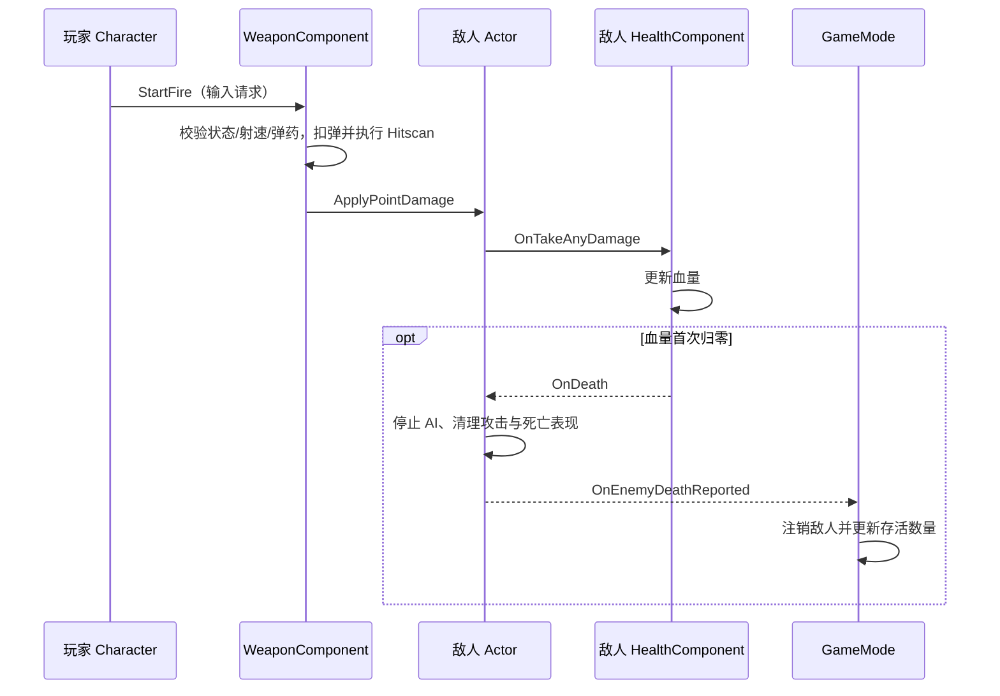
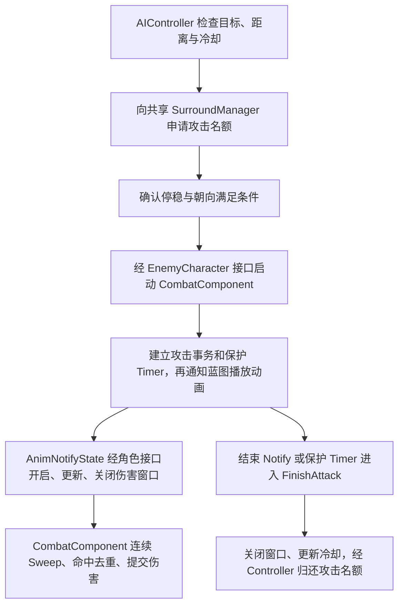
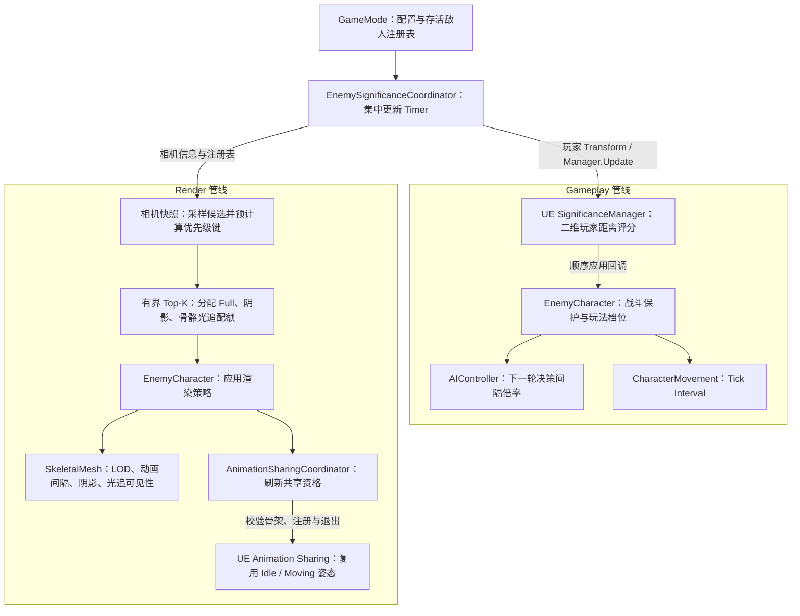

# fpstrue

基于 Unreal Engine 5.5 和 C++ 开发的单机 PvE FPS Demo。项目已经形成角色控制、武器战斗、敌人 AI、群体围攻、波次结算和 HUD 的完整玩法闭环，并围绕多敌人场景建立了可重复的性能测试与消融流程。

> 本仓库用于源码与性能分析展示，不包含地图、模型、动画、音频等二进制或第三方 `Content` 资产。
> 因此可以直接阅读和编译 C++ 模块，但若要还原完整画面与关卡，需要自行提供具有合法授权的对应资源。
>
> `fps-v2` 同时保留用于项目复习的 UE/C++ 语法注释，完整说明见
> [FPS 项目架构、性能与 UE 机制说明](Docs/FPS_PROJECT_ENGINEERING_NOTES.md)。

## 项目内容

- 第一人称移动、跳跃、冲刺、瞄准和武器拾取。
- 自动射击、弹药与换弹、Hitscan 部位伤害、散布和后坐力。
- 玩家与敌人复用生命组件，统一处理受伤、死亡和一次性结算。
- 敌人目标判断、NavMesh 寻路、近战攻击窗口和死亡布娃娃。
- 双环站位、稳定槽位、最多 8 个并发攻击者和 MoveTo 请求限流。
- 三波敌人生成、倒计时、存活数量和胜负事件。
- HUD 通过委托接收生命、弹药和对局状态变化，避免每帧函数绑定。

## 玩法架构

项目采用 UE Gameplay Framework 下的组件化设计：**角色连接输入和组件，Controller 决定敌人行为，组件维护具体动作与数值，共享 Manager 协调群体资源，GameMode 管理对局。**这些代码仍属于一个 `fpstrue` Runtime 模块，目录划分不代表独立插件或额外运行时层。

### 1. 状态归属与对象关系

划分依据是“谁有权修改这份状态”，而不只是把长文件拆短。表中省略类名的 `fpstrue` 前缀，完整源码链接见后面的导航。

| 对象 | 自己维护的状态 / 职责 | 与其他对象的边界 |
| --- | --- | --- |
| `Character` | 玩家输入、瞄准、冲刺、当前装备引用 | 把开火和换弹请求交给武器，不保存另一份弹药或血量 |
| `WeaponComponent` | Ready/Firing/Reloading/Disabled、弹药、换弹提交、散布与后坐力 | 执行 Hitscan 并提交伤害；不直接修改目标的生命值 |
| `HealthComponent` | 当前/最大血量、死亡通知去重 | 玩家和敌人各有实例；不依赖具体角色、HUD 或 GameMode |
| `EnemyAIController` | 目标、Idle/Chase/Attack/Dead 决策状态、下一轮决策时间、移动目标缓存 | 决定何时移动或尝试攻击，不执行刀刃检测和扣血 |
| `EnemyCharacter` | 组件装配、角色表现、性能档位应用与生命周期协调 | 提供攻击查询/请求接口；攻击状态查询委托给 CombatComponent，死亡状态查询委托给 HealthComponent |
| `EnemyCombatComponent` | 攻击事务、有效伤害窗口、冷却、单次命中标记 | 通过动画通知驱动 Sweep；结束后经 Controller 归还攻击名额 |
| `SurroundManager` | 共享导航目标、槽位占用、并发攻击集合、每帧 MoveTo 请求计数 | 本局敌人共用，不接管每个敌人的状态机 |
| `GameMode` | 波次、生成队列、敌人注册表、倒计时、胜负 | 负责装配与事件订阅，不参与每次射击或每轮寻路决策 |

对象装配上，玩家持有自己的 Health、CharacterMovement、Camera 和 Mesh；每个敌人持有自己的 Health、Combat、CharacterMovement 和 Mesh。EnemyAIController 是通过 Possess 控制敌人的独立 Actor，不是敌人的子组件。武器装备时挂到玩家 Mesh 插槽并登记引用，不会因此变成玩家的默认子组件。

GameMode 分帧生成敌人，向对应 Controller 注入玩家和同一个 SurroundManager，再绑定死亡、销毁和 EndPlay 事件。注册表使用 `TSet<TWeakObjectPtr<AfpstrueEnemyCharacter>>`：集合保证唯一性，弱引用不阻止销毁；三种离场通知共用幂等注销入口，集中采样前再清除失效条目，覆盖直接销毁与关卡卸载。

### 2. 玩法调用链

#### 玩家射击：请求、结算与结果通知分离

下面是一次有效射击命中敌人的调用过程；箭头表示调用或通知，不表示对象包含关系。



拾取入口只检测玩家并请求 `AttachWeapon`；装备成功后关闭拾取碰撞并广播结果。HUD 和音画表现通过装备、弹药、生命及对局事件观察结果，不参与伤害或弹药结算。

#### 敌人攻击：单体决策与群体资源分离

每个 Controller 的一次性 Timer 驱动决策。以下表示成功发起攻击后的阶段顺序，不表示每个方框都是独立类。



攻击条件不满足时不会沿成功路径继续：未获名额者维持 Chase 和包围站位，转身未完成者归还本轮名额后等待下一轮。`EndAttackWindow` 只关闭伤害窗口，不提前结束完整攻击事务；敌人死亡时另行调用 `ResetCombat` 取消攻击。`StopAI` 负责停止决策与移动并释放共享资源，不等同于重置 Combat。

移动链独立于攻击：`AIController::MoveToGoal → UE 导航与 PathFollowing → CharacterMovement`。Controller 在提交前处理目标去重、全局请求预算与失败退避；CharacterMovement 执行实际位移和转向。Timer 仍在 Game Thread 上运行，决策降频不等于关闭移动或启用后台线程。

### 3. 性能策略接入

GameMode 持有 Significance 和 Animation Sharing 两个协调组件；它们通过 EnemyCharacter 应用策略，不替代 AI 状态机或攻击事务。SurroundManager 独立维护共享导航目标、槽位与请求预算。配置、调度与消费者关系见下文的[性能优化架构](#性能优化架构)。

### 4. 生命周期与验证边界

清理与正常流程共用出口：玩家死亡时武器停止 Timer 并禁用动作，武器 EndPlay 再解除装备关系；敌人停止 AI 时归还槽位与攻击许可，GameMode 用同一注销入口处理死亡、直接销毁和 EndPlay，并解除三个事件的绑定。重复通知不会重复扣减存活数量；GameMode 自身退出时统一清空注册与订阅。

验证覆盖算法、玩法边界和性能实验：

- **玩法边界测试**：[GameplayBoundaryTests](Source/fpstrue/Testing/Automation/fpstrueGameplayBoundaryTests.cpp) 在临时世界调用真实接口，当前覆盖朝向边界、攻击重置后的通知、射击命中/未命中与扣弹、换弹委托重入，以及配置读取。它不是完整关卡、动画资产或所有异常路径的覆盖证明。
- **渲染预算测试**：[RenderPriorityTests](Source/fpstrue/Testing/Automation/fpstrueEnemyRenderPriorityTests.cpp) 覆盖比较器传递性、极接近评分、无效浮点值，以及 Top-K 对完整排序的集合等价性；预算覆盖 0 到候选数以上，并校验正反遍历顺序。
- **共享生命周期测试**：[EnemyLifecycleTests](Source/fpstrue/Testing/Automation/fpstrueEnemyLifecycleTests.cpp) 在临时世界调用插件真实注销接口，覆盖三个 Follower 批量退出、交换句柄后的显著性更新、LOD 控制恢复，以及重复清理和未知回调。
- **性能实验**：BenchmarkRunner 驱动场景准备、预热、采集与有效性检查；脚本保存参数、环境和输入指纹，再结合消费者计数、局部耗时和整帧指标对照。完整玩法基线与破坏性诊断分开解释，证据限制见下文及 [实验报告](PERFORMANCE_EVIDENCE.md)。

配置优先沿用蓝图可编辑属性；共享动画默认资源路径放在项目 INI，JSON 只作为实验脚本预设，不引入第二套玩法状态。入口、优先级与生效时机见 [配置说明](Docs/CONFIGURATION.md)。

## 源码快速导航

以下链接可以直接打开核心实现，避免在 `Source/fpstrue/` 中逐个查找：

| 功能 | 头文件 | 实现文件 | 重点入口 |
| --- | --- | --- | --- |
| 玩家输入、移动与组件协调 | [fpstrueCharacter.h](Source/fpstrue/Characters/Player/fpstrueCharacter.h) | [fpstrueCharacter.cpp](Source/fpstrue/Characters/Player/fpstrueCharacter.cpp) | `SetupPlayerInputComponent`、`StartWeaponFire`、`RequestWeaponReload`、`HandleDeath` |
| 玩家武器、射击与换弹 | [fpstrueWeaponComponent.h](Source/fpstrue/Weapons/fpstrueWeaponComponent.h) | [fpstrueWeaponComponent.cpp](Source/fpstrue/Weapons/fpstrueWeaponComponent.cpp) | `StartFire`、`FireLineTrace`、`RequestReload`、`CommitReload` |
| 玩家与敌人复用生命组件 | [fpstrueHealthComponent.h](Source/fpstrue/Characters/Shared/fpstrueHealthComponent.h) | [fpstrueHealthComponent.cpp](Source/fpstrue/Characters/Shared/fpstrueHealthComponent.cpp) | `HandleOwnerTakeAnyDamage`、`ApplyDamageInternal` |
| 单敌人状态决策与寻路 | [fpstrueEnemyAIController.h](Source/fpstrue/Characters/Enemies/fpstrueEnemyAIController.h) | [fpstrueEnemyAIController.cpp](Source/fpstrue/Characters/Enemies/fpstrueEnemyAIController.cpp) | `UpdateAI`、`GetNextDecisionInterval`、`MoveToGoal` |
| 敌人攻击事务与刀刃检测 | [fpstrueEnemyCombatComponent.h](Source/fpstrue/Characters/Enemies/fpstrueEnemyCombatComponent.h) | [fpstrueEnemyCombatComponent.cpp](Source/fpstrue/Characters/Enemies/fpstrueEnemyCombatComponent.cpp) | `TryAttackTarget`、`UpdateAttackWindow`、`SweepWeaponSegment`、`FinishAttack` |
| 攻击动画有效窗口 | [fpstrueAnimNotifyState_AttackWindow.h](Source/fpstrue/Characters/Enemies/fpstrueAnimNotifyState_AttackWindow.h) | [fpstrueAnimNotifyState_AttackWindow.cpp](Source/fpstrue/Characters/Enemies/fpstrueAnimNotifyState_AttackWindow.cpp) | `NotifyBegin`、`NotifyTick`、`NotifyEnd` |
| 群体槽位与全局请求预算 | [fpstrueSurroundManager.h](Source/fpstrue/Characters/Enemies/fpstrueSurroundManager.h) | [fpstrueSurroundManager.cpp](Source/fpstrue/Characters/Enemies/fpstrueSurroundManager.cpp) | `RequestSurroundSlot`、`TryAcquireAttackPermission`、`TryConsumeMoveRequestBudget` |
| 敌人角色、LOD与渲染策略落地 | [fpstrueEnemyCharacter.h](Source/fpstrue/Characters/Enemies/fpstrueEnemyCharacter.h) | [fpstrueEnemyCharacter.cpp](Source/fpstrue/Characters/Enemies/fpstrueEnemyCharacter.cpp) | `ApplySignificance`、`EvaluateRenderSignificance`、`ApplyRenderSignificanceSettings`、`HandleDeath` |
| Significance集中采样和预算分配 | [fpstrueEnemySignificanceCoordinator.h](Source/fpstrue/Characters/Enemies/fpstrueEnemySignificanceCoordinator.h) | [fpstrueEnemySignificanceCoordinator.cpp](Source/fpstrue/Characters/Enemies/fpstrueEnemySignificanceCoordinator.cpp) | `Update`、有界 Top-K、Full/Shadow/RT预算下发 |
| Animation Sharing适配 | [fpstrueEnemyAnimationSharingCoordinator.h](Source/fpstrue/Characters/Enemies/fpstrueEnemyAnimationSharingCoordinator.h) | [fpstrueEnemyAnimationSharingCoordinator.cpp](Source/fpstrue/Characters/Enemies/fpstrueEnemyAnimationSharingCoordinator.cpp) | `BuildRuntimeSetup`、`RefreshEnemyRegistration`、`SuspendEnemy` |
| 波次、注册表与模块装配 | [fpstrueGameMode.h](Source/fpstrue/Game/fpstrueGameMode.h) | [fpstrueGameMode.cpp](Source/fpstrue/Game/fpstrueGameMode.cpp) | `StartGameMode`、`SpawnNextQueuedEnemy`、`RegisterEnemy`、`FinishGame` |
| Benchmark命令行配置 | [fpstrueBenchmarkConfig.h](Source/fpstrue/Testing/Benchmarks/fpstrueBenchmarkConfig.h) | [fpstrueBenchmarkConfig.cpp](Source/fpstrue/Testing/Benchmarks/fpstrueBenchmarkConfig.cpp) | 消融参数解析与策略覆盖 |
| Benchmark执行和消费者计数 | [fpstrueBenchmarkRunner.h](Source/fpstrue/Testing/Benchmarks/fpstrueBenchmarkRunner.h) | [fpstrueBenchmarkRunner.cpp](Source/fpstrue/Testing/Benchmarks/fpstrueBenchmarkRunner.cpp) | `BeginBenchmark`、`StartCapture`、`ApplyDiagnosticOverrides` |
| 项目性能埋点 | [fpstruePerformanceStats.h](Source/fpstrue/Testing/Benchmarks/fpstruePerformanceStats.h) | — | AI、生成、攻击Sweep的Stat与CSV指标声明 |

性能结论和截图入口：

- [分阶段性能实验记录：策略、结果与后续决策](Docs/Performance/EXPERIMENT_LOG.md)
- [早期规模测试与消费者消融明细](PERFORMANCE_EVIDENCE.md)
- [160敌人Unreal Insights截图](PerformanceEvidence/UnrealInsights_160Enemies.png)
- [性能测试脚本目录](Tools/)

核心玩法状态由 C++ 维护；蓝图和 UMG 通过委托、Blueprint 事件及只读查询完成动画、音效、特效和界面表现。

## 性能优化架构

性能策略分为**配置、集中采样与分配、消费者执行、采集验证**四个环节。下面描述已经接入的控制链；它不是按实时帧耗时自动调参的自适应系统，策略生效与性能净收益分别验证。

### 1. 配置与运行时装配

| 配置 / 状态 | 所在位置 | 使用者 |
| --- | --- | --- |
| 决策间隔、移动/动画间隔、玩法距离阈值 | AIController / EnemyCharacter 的蓝图可编辑属性 | 各敌人的决策与更新组件 |
| 渲染权重、迟滞阈值、Full/Shadow/RT 配额 | GameMode 的 `FFPEnemyRenderSignificancePolicy` | SignificanceCoordinator 采样，并通过有界 Top-K 分配 |
| 槽位、攻击名额、MoveTo 请求预算 | SurroundManager 的可编辑属性 | Controller 申请共享资源 |
| Idle/Moving 动画与共享池参数 | AnimationSharingCoordinator；动画软引用默认值来自项目 INI | 构建 UE Animation Sharing 的运行时 Setup |
| 实验规模、预热/采样时间、消融开关 | 脚本参数 / JSON 预设 → 命令行 → BenchmarkConfig | Runner 与对应策略消费者 |

对局启动时，GameMode 先创建共享 SurroundManager，再启动动画共享与 Significance 协调器，最后进入分帧生成。敌人 BeginPlay 自行注册到 UE SignificanceManager；GameMode 的存活注册表另供 Render 管线遍历。死亡/EndPlay 注销评分，离场时退出共享池，结束对局时停止集中更新 Timer。

### 2. 双管线：Gameplay 与 Render

图中箭头表示数据和策略下发方向。项目的 `EnemySignificanceCoordinator` 与引擎的 `USignificanceManager` 是不同对象。



**Gameplay 管线**：基础分数为 `1 / (1 + 二维距离)`，EnemyCharacter 根据距离阈值转成 Full/Reduced/Background；正在攻击或目标已进入攻击范围时保持 Full。应用回调顺序执行，档位改变后再下发决策倍率与移动间隔。相机视锥不参与这条管线，背后的敌人仍可追击。

**Render 管线**：每轮先构建相机快照，以 Mesh 包围球和 FOV 近似判断主/扩展视锥，结合投影屏幕半径、最近进入主视锥的时间和相机距离计算分数。每个敌人的采样结果和优先级键写入连续候选数组，选择阶段只比较数值，不再查询 Actor 或组件。这里的“近期可见”是视锥历史，不是读取 GPU 遮挡查询结果。

优先级依次为主视锥、扩展视锥、评分、对象 ID。评分完全相等才使用 ID 决胜，不使用 `IsNearlyEqual`，避免近似相等不满足传递性而破坏严格弱序；比较器将非有限评分放在同一视锥层级的有效评分之后。对象 ID 保证同一批候选的选择不受遍历顺序影响。

预算分配使用**有界 Top-K 堆**替代全部候选排序：先选 Full，再从最终档位满足条件的对象中选骨骼光追与阴影参与者。堆顶保存当前入选者中优先级最低的一项，新候选更优时才替换。三类预算顺序复用同一个堆，默认名额可放入 32 项内联容量；单项预算只需线性扫描和至多 `O(log K)` 的单次堆调整，额外选择空间为 `O(K)`。关闭某项预算时沿用该项的原有放开规则。

该改动已通过选择结果等价性测试，实际帧时间收益仍需同条件测量。候选数组目前每轮创建并 `Reserve`，尚未改为跨轮次复用缓冲。

自然渲染档位使用进入/退出阈值、最短保持时间和降级延迟；Full 配额在自然档位之后另行限制。阴影候选还需满足扩展视锥、距离和非 Background 档，骨骼光追候选需满足最终 Full 档与距离。原生默认上限分别为 Full 12、阴影 5、骨骼光追 12，实际数量取决于资格、蓝图覆盖和实验参数。

**玩法响应保护**：攻击中或目标进入攻击范围时，Gameplay 档位保持 Full；AI 在战斗附近使用默认 0.1 s 的决策间隔，不乘远距离档位倍率。攻击开始直接将 Movement TickInterval 设为 0，恢复逐帧更新配置。距离档位由协调器采样；已有 AI Timer 不会仅因倍率变化立即重排，因此不能宣称所有升档都零延迟。

**战斗动画保护**：攻击、近战范围或近期交互保护骨骼更新并排除姿态共享；攻击开始直接恢复骨骼组件逐帧配置和 AlwaysTickPoseAndRefreshBones，并解除额外最低 LOD 限制（不是强制实际 LOD0）。这条保护不会抬高 RenderScore 或额外获得阴影/光追名额。受击会刷新近期交互并退出共享，但不直接将玩法档位设为 Full 或提前唤醒 AI Timer。

实现入口：[Coordinator::Update](Source/fpstrue/Characters/Enemies/fpstrueEnemySignificanceCoordinator.cpp)、[EnemyCharacter 的评分与应用](Source/fpstrue/Characters/Enemies/fpstrueEnemyCharacter.cpp)。

### 3. 消费者独立执行，不是所有系统每 0.25 秒才运行一次

以下是原生默认配置，不代表每次实验的实测频率；蓝图和实验覆盖可改变它们。

| 消费者 / 调度者 | 更新方式 | 受控内容与边界 |
| --- | --- | --- |
| SignificanceCoordinator | 默认 0.25 s 集中 Timer | 统一评分与预算分配时刻，不驱动整套 AI、移动或动画逐帧执行 |
| AIController | 每个敌人独立、首次错峰的一次性 Timer | 战斗附近/追击/远距离/Idle 基础间隔为 0.1/0.25/0.5/1 s；非紧急分支再乘玩法档位倍率 1/1.5/2，战斗响应保留 0.1 s |
| CharacterMovement | 自己的组件 Tick | Full 为每帧，Reduced 为 1/30 s，Background 为 0.05 s；攻击开始恢复每帧更新 |
| SkeletalMesh | 自己的组件及引擎动画更新链 | 独立姿态的请求间隔为每帧、1/30 s、0.05 s；共享后还受插件 Leader 调度影响，不能把配置值直接当成实际求值次数 |
| AnimationSharingCoordinator | 角色渲染应用/战斗事件触发资格刷新，无自身轮询 Tick | 姿态更新由 UE 插件负责，资格变化时注册或退出 |
| SurroundManager | 默认 0.25 s 采样；目标移动达到默认 200 cm 后刷新位置和槽位投影 | 导航缓存不替代近战距离和朝向的实时判断；MoveTo 预算用帧号重置计数，不依赖此 Timer |
| GameMode / HUD | 默认 0.05 s 消费一个生成请求；倒计时每秒推送 | 分散生成开销，HUD 通过事件更新；死亡后的 LifeSpan 回收不是 Actor 对象池 |

槽位、攻击许可和新路径请求是三种不同资源：默认 8 个内环与 12 个外环槽位管理站位，8 个攻击名额限制并发攻击事务，每帧 8 个 MoveTo 请求中包含 2 个近战预留。Controller 先做目标去重与失败退避，再向 Manager 申请提交预算；被拒绝只延后新请求，不停止已有路径。攻击名额按申请获得，不参与 Render 排名。

### 4. Animation Sharing：复用姿态，不合并敌人逻辑

AnimationSharingCoordinator 根据首波敌人类的 Mesh/Skeleton 与配置动画构建运行时 Setup，交给 UE AnimationSharingManager。当前 Setup 只配置一套骨架的 Idle/Moving；状态处理器读取现有 AI 状态与实际速度，将站定的 Chase 映射为 Idle。

Render 应用后，EnemyCharacter 刷新共享资格：非 Full Render、无战斗保护、存活且未模拟物理，再由 Coordinator 校验骨架匹配并注册。攻击前、受击和死亡时退出；资格不变时只更新共享句柄的重要性。敌人仍保留自己的 Controller、Movement、Health、Combat 和 Transform，攻击使用独立 Montage/Notify/Socket 链。它不等同于 ISM/HISM，也不直接把所有敌人合成一个 Draw Call。

注册过程分别记录“等待句柄”和“已经注册”，避免插件返回句柄前重复发起注册。UE 5.5 同步交付句柄，无回调的失败请求在注册调用返回后清除，允许下一轮重试。退出共享时撤销登记并恢复项目的骨骼 LOD 控制；`Stop` 先停止接纳，再清理登记，`EndPlay` 继续释放 Manager、Setup 和 Skeleton 引用。

插件注销采用 `RemoveAtSwap`，会在数组调整完成前同步通知被交换角色的新句柄。因此句柄回调只更新本地记录，实际注销放在回调外执行；停止期间仍接收剩余对象的句柄更新，防止递归注销破坏插件索引。

实现入口：[BuildRuntimeSetup / RefreshEnemyRegistration / SuspendEnemy](Source/fpstrue/Characters/Enemies/fpstrueEnemyAnimationSharingCoordinator.cpp)。

### 5. 策略验证与性能归因

运行时策略和实验控制分开：脚本选实验组并启动进程，BenchmarkConfig 解析命令行，Runner 与消费者应用对应覆盖；Runner 等待规模就绪、预热、启动 CSV/可选 Trace，采集前后校验敌人规模、玩家状态及固定视点。项目埋点同时记录档位人数、共享 Follower、阴影/光追参与者、MoveTo 提交次数等，确认开关确实影响了目标消费者。

实验记录至少区分三种用途：

- **完整玩法基线**：正常玩法消费者保持开启；`RunPerformanceMatrix.ps1` 不覆盖玩家生命，死亡或对局提前结束使样本无效。
- **固定场景成本对照**：`RunRenderCostMatrix.ps1` 支持 JSON 预设，显式命令行 > JSON > 脚本默认值；默认把玩家生命覆盖为 1000000，以维持静态成本采样，不能等同于正常生存压力基线。该矩阵中的 `Baseline` 只是本组实验的对照项名称。
- **消费者消融 / 破坏性诊断**：关闭某项分级与关闭整个 Movement/Mesh Tick 的含义不同。前者比较策略，后者只辅助确定成本上界，不能作为保留玩法的优化方案。

先用消费者计数和目标局部耗时确认机制，再比较同条件下的整帧 Mean/P95/P99；RT/RHI 耗时高时结合 Insights 的实际执行、任务依赖和等待区间分析，不把线程等待直接当成线程计算量。GPU Pass、动态光追几何更新和 BLAS 构建需分别核对所在轨道。当前没有根据这些测量自动寻找最优参数或自动修改画质的运行时闭环。

配置与校验入口：[RunRenderCostMatrix](Tools/RunRenderCostMatrix.ps1)、[BenchmarkConfig](Source/fpstrue/Testing/Benchmarks/fpstrueBenchmarkConfig.cpp)、[BenchmarkRunner](Source/fpstrue/Testing/Benchmarks/fpstrueBenchmarkRunner.cpp)。实验进展见[分阶段性能实验记录](Docs/Performance/EXPERIMENT_LOG.md)，早期数据明细见 [PERFORMANCE_EVIDENCE.md](PERFORMANCE_EVIDENCE.md)；配置入口见 [CONFIGURATION.md](Docs/CONFIGURATION.md)。

### 实验进展（记录截至 2026-09-16）

实验按“规模诊断 → 保留玩法的消费者策略 → 测试口径修正 → RT 等待归因 → GPU 工作分解”推进，各阶段记录策略、实测结果、后续行动及原因。

| 阶段 | 已确认的结果 | 状态与后续 |
| --- | --- | --- |
| AI、移动与动画 | 历史 AI 降频减少决策与路径请求；80 敌人重复消融确认 Movement 分级、Animation Sharing 的局部收益 | LOD、动画 Tick 分级的独立净收益尚未建立 |
| 敌人渲染消费者 | 阴影与骨骼光追参与限制降低目标局部成本；160 敌人继续关闭残余消费者时，整帧收益有限 | 保留预算，转向场景与同步链归因 |
| RVO / Detour Crowd | 160 敌人候选比较中 Detour 的 Frame、GT 均值更高 | 保留 RVO；不推广为两种算法的通用性能结论 |
| 零敌人与 RT 等待 | 零敌人仍有长等待；TaskTrace、源码和查询开关干预把关键路径追到遮挡查询结果同步 | 不是“敌人 Mesh 函数计算了整个等待时长” |
| 查询策略候选 | HZB 的等待转移且正式矩阵整帧回退；Buffer2 有改善信号 | HZB 不采用；Buffer2 缺一轮合格对照及视觉验证，未改默认 |
| GPU 分辨率诊断 | SP50 短测中 GPUTime 与 RT 等待下降，RHI 升高，尾帧基本未改善 | 两次原始记录均未通过全部门禁，仅作探索；继续拆分照明相关 Pass |

完整玩法、正常生命条件下的 160 敌人长期回归基线仍未验收；高生命固定视点实验用于成本归因，不能替代该基线。各批有效性、剔除原因和原始报告目录均保留在[实验记录](Docs/Performance/EXPERIMENT_LOG.md)。

### 历史性能样本与证据范围

历史 Development Editor 样本在 `Demonstration` 地图、1600×900、关闭 VSync、固定随机种子并完成预热后，160 个敌人的 Game Thread 平均耗时为 `7.707 ms`。该样本由旧版测试器采集，测试时排除了 HUD、声音和玩家受伤，因而只保留为敌人侧优化的历史趋势证据，不能作为现在的完整玩法基线。当前完整基线需要在新版测试器上重新采集；它同样不能仅凭 GT 数值证明整帧稳定达到 60 FPS。

### 历史趋势对照（非严格 A/B）

下面的数据来自早期版本与旧版测试器的两轮 160 敌人测试。两轮都使用 `Demonstration` 地图、1600×900、独立 Development Editor 进程、关闭 VSync，并采样约 30 秒；但它们**不是严格的单变量 A/B 实验**：测试二进制不同，预热时间由 10 秒调整为 15 秒，后一版本才固定随机种子 `1337`，且每个版本只有一次运行；旧测试器还移除了 HUD、关闭声音并将玩家设为不可受伤。Render Thread / RHI Thread 也存在明显的运行级波动。因此，这组数据只用于展示敌人侧的演进趋势，不能作为完整玩法基线，不能把全部差值归因于 Significance 或某一个具体优化，也不能据此声称整体性能提升了同样比例。

| 整体指标 | 早期样本（08-16） | 后期历史样本（08-30） | 变化 |
| --- | ---: | ---: | ---: |
| Frame | 27.907 ms | 30.899 ms | +10.7% |
| Game Thread | 27.899 ms | 7.707 ms | -72.4% |
| Render Thread | 14.182 ms | 30.411 ms | +114.4% |
| GPU | 14.205 ms | 9.039 ms | -36.4% |

| 敌人相关指标 | 早期样本（08-16） | 后期历史样本（08-30） | 变化 |
| --- | ---: | ---: | ---: |
| Character Movement | 6.188 ms | 1.636 ms | -73.6% |
| Animation | 4.448 ms | 0.814 ms | -81.7% |
| Tick Actors | 5.211 ms | 0.682 ms | -86.9% |
| AI Decision | 0.201 ms | 0.039 ms | -80.6% |
| MoveTo 提交/帧 | 14.565 | 0.109 | -99.3% |
| Draw Calls | 3458 | 1786 | -48.4% |

这组对照显示敌人移动、动画、AI 和提交频率的 CPU 扩展成本下降，但整体 Frame 没有同步改善，后期历史样本的关键路径偏向 Render Thread / RHI Thread。不能把跨版本差值归给某个单项策略，后续等待链归因见分阶段记录。

## 环境与运行

源码编译要求：

- Unreal Engine 5.5。
- Visual Studio 2022，并安装“使用 C++ 的游戏开发”和对应 Windows SDK。

可先生成 Visual Studio 项目文件并编译 `fpstrueEditor` 的 Development Editor 配置。完整开发环境中的编辑器与游戏默认地图为：

```text
/Game/FactoryDistrict/Maps/Demonstration
```

公开仓库未分发该地图及其依赖资产；上述路径仅用于说明源码与配置的原始运行入口。完整开发环境进入地图后，由关卡或 UI 调用 `Start GameMode` 启动正式波次流程。

源码回归使用 UE Automation。Development Editor 编译后，可在编辑器的 Session Frontend → Automation 中运行 `fpstrue.` 测试组，或在终端执行：

```powershell
& "<UE5.5目录>\Engine\Binaries\Win64\UnrealEditor-Cmd.exe" "<项目目录>\fpstrue.uproject" -Unattended -NullRHI -NoSplash -NoSound -DDC-ForceMemoryCache '-ExecCmds=Automation RunTests fpstrue.' '-TestExit=Automation Test Queue Empty' -Log
```

本轮 Development Editor 编译通过，8 项自动化测试全部通过，日志位于 `Saved/Logs/fpstrue.log`。NullRHI 测试验证代码与算法边界；共享动画的视觉切换和完整场景性能由实际关卡回归验证。

实验配置另有 `Tools/TestRenderCostConfig.ps1`，29 项检查覆盖参数优先级、非法输入、DryRun 与采集前校验；执行时不启动 UE，当前全部通过。

## 性能测试

按阶段推进的策略、结果、未通过样本与下一步见[性能实验记录](Docs/Performance/EXPERIMENT_LOG.md)；早期消费者消融的逐组明细见 [PERFORMANCE_EVIDENCE.md](PERFORMANCE_EVIDENCE.md)。

正式性能基线固定为 160 个敌人；20/80 敌人只用于快速调试，不作为当前基线结论。基线不传入任何
`BenchmarkDisable*` 参数，并保留 HUD、声音、玩家受伤/死亡、碰撞、AI、移动、动画与渲染消费者：

```powershell
.\Tools\RunPerformanceMatrix.ps1 -Counts 160 -WarmupSeconds 15 -DurationSeconds 30 -BenchmarkSeed 1337 -RunName PerformanceBaseline160
```

玩家死亡或对局在采集结束前终止时，Runner 会停止采集并让脚本判定本次样本无效；它不会通过无敌、移除 UI 或强制重叠生成来换取一份“成功”的数据。

当前自动测试没有代替玩家进行移动和战斗，160 个敌人全部生成后，静止玩家通常会在约 3.7–5.4 秒内死亡。因此上面的 15 秒预热、30 秒采集是正式稳态基线的目标口径，但当前会被正确拒绝。现阶段已经用零预热、2 秒采集完成三次完整玩法链路冒烟测试；要建立长期稳定基线，应先接入确定性的玩家操作回放，而不是重新关闭伤害或 UI。

80 敌人消费者消融：

```powershell
.\Tools\RunEnemyOptimizationAblation.ps1 -EnemyCount 80 -RunsPerGroup 3 -UnverifiedConsumersOnly
```

脚本默认使用本机 UE 与项目绝对路径；换机器运行前需要修改脚本顶部的 `$ProjectRoot` 和 `$Editor`。运行结果写入 `Saved/Profiling/`，该目录不提交到 Git。

## 仓库目录

```text
Config/                         项目、输入和默认地图配置
Source/fpstrue/                  C++ Runtime 模块
  Game/                         对局流程、波次与胜负结算
  Characters/                   玩家、敌人与共用角色代码
    Player/                     玩家角色、输入与移动
    Enemies/                    敌人角色、AI、近战、围攻、动画与 Significance
    Shared/                     通用生命组件与碰撞通道
  Weapons/                      武器、射击、换弹、拾取与换弹动画通知
  Testing/                      性能诊断与自动化测试
    Benchmarks/                 Benchmark 配置、采集与性能埋点
    Automation/                 玩法边界、比较器与 Top-K 自动化测试
Tools/                          性能采集、消融和资产审计脚本
PerformanceEvidence/            可公开的性能截图
Docs/Performance/               分阶段性能实验记录
```

源码按业务归属分类：玩家、敌人与共用角色代码统一放在 `Characters` 下，保留 `Player`、`Enemies` 和 `Shared` 子目录；换弹通知归入 `Weapons`，敌人攻击通知、Animation Sharing 和 Significance 归入 `Characters/Enemies`，性能诊断与自动化测试统一放在 `Testing` 下。以上分类仍属于同一个 `fpstrue` 模块；每组 `.h` 和 `.cpp` 放在同一功能目录中，模块入口 `fpstrue.h`、`fpstrue.cpp` 和构建规则 `fpstrue.Build.cs` 保留在模块根目录。目录整理保留原有类名与资产路径。
