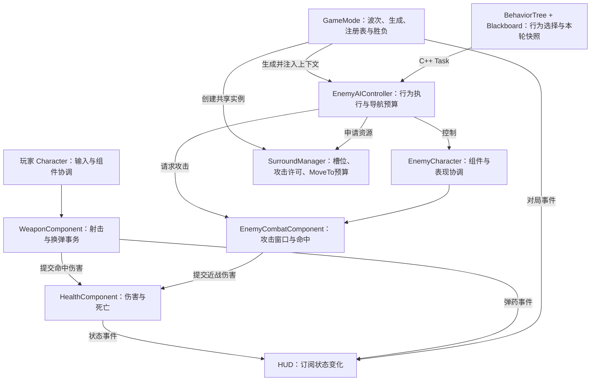
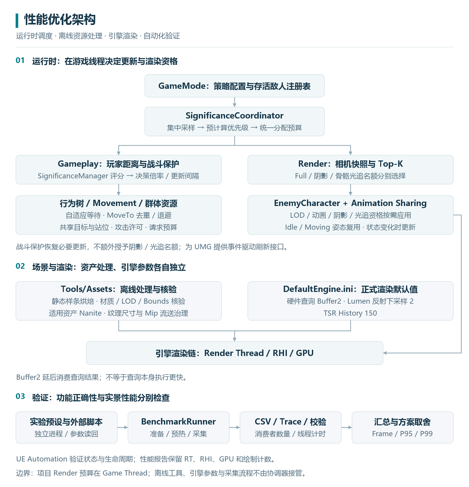
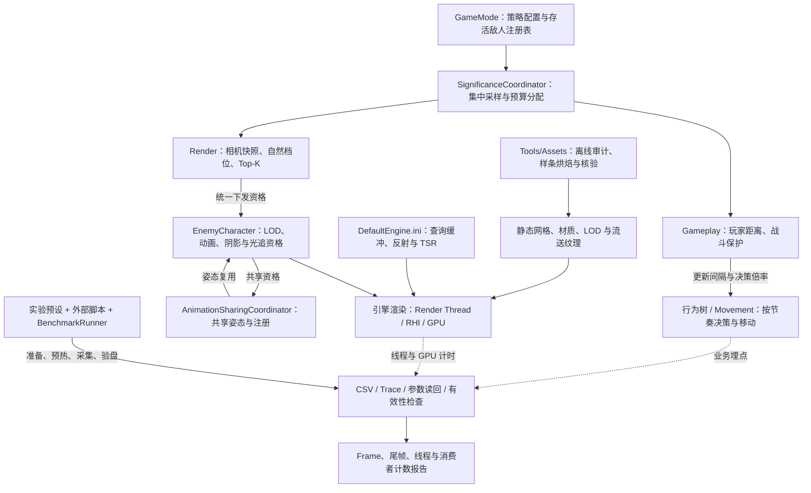
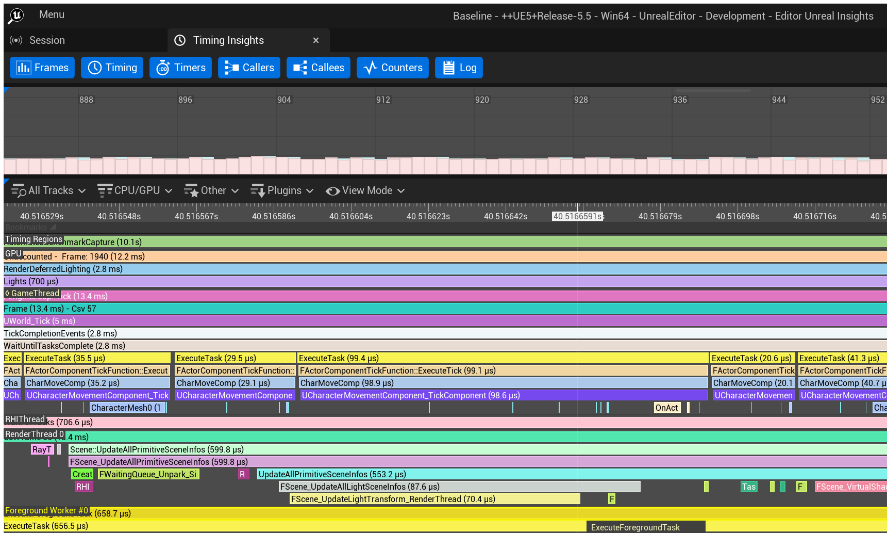

# fpstrue · UE5 C++ FPS

基于 Unreal Engine 5.5 和 C++ 的单机 PvE FPS Demo，实现射击、换弹、敌人追击与近战、群体围攻、波次结算和事件驱动 HUD 接口，并围绕 160 敌人场景开展性能分析与优化。

> `review` 用于完整项目开发与复习，保留 Content 资产和“语法复习”注释；`main` 用于面试展示，不随开发分支自动更新。
> [FPS项目架构、性能与UE机制说明](Docs/FPS_PROJECT_ENGINEERING_NOTES.md)保留复习笔记；最新目录和优化记录以本页及实验报告为准。
> 当前状态归属、阅读顺序和动画回调迁移边界见[代码职责与动作生命周期](Docs/CODE_OWNERSHIP.md)。

项目重点是完整玩法实现、多敌人更新调度，以及从实验数据追到线程依赖的性能归因。

> 本分支提供源码、配置、测试脚本、性能记录和 Git LFS 管理的项目资产；仅供有对应资源使用权限的开发环境使用。`main` 展示分支不分发第三方 Content 资产。

## 项目亮点

- **FPS 玩法架构设计**：角色协调输入与装备，武器组件负责射击和换弹，生命组件统一处理伤害与死亡，GameMode 管理波次、生成与胜负。C++ 实现规则和状态，蓝图接入动画、音效与界面，形成输入、动作、命中、伤害、反馈的完整链路。
- **武器状态切换与冲突约束**：统一管理装备、射击、换弹和禁用状态，协调 ADS、冲刺与武器动作，避免多个入口互相覆盖。换弹通过动作编号和动画播放实例识别回调，统一处理装填提交、完成、中断及超时，防止重复补弹、旧通知误提交和取消后状态残留。
- **敌人行为树与群体战术协作**：C++ Task、Blackboard 与可编辑行为树组织追击、包围、站位和攻击；群体管理分配站位与攻击许可，避免所有敌人同时挤向玩家。MoveTo 结合目标去重、失败退避、帧级预算和请求身份校验，在限制重复寻路的同时保留战斗响应。
- **覆盖 UI、玩法调度与场景渲染的性能优化**：为 UMG 提供事件驱动刷新接口；Gameplay 与 Render 分别评分，通过决策降频、移动分级、Animation Sharing 和阴影/光追预算减少重复工作，战斗时恢复必要更新。有界 Top-K、数据快照和缓冲复用降低调度开销；场景侧结合查询缓冲、反射下采样、静态样条烘焙、TSR 与纹理流送治理，按整帧和尾帧选择方案。具体收益与证据分级见下文。
- **生命周期与资源清理治理**：死亡、销毁和 EndPlay 共用清理入口，停止 AI、移动和 Timer，释放委托、站位、攻击许可与共享动画注册。弱引用注册表、幂等注销及回调重入保护约束对象失效边界；尸体保留需要的表现，撤销不必要的阴影和光追参与。
- **配置抽离，便于策划调参与测试**：波次、近战和武器参数集中到配置资产，蓝图选择表现资源；武器首次装备校验并保存配置快照，共享配置不共享弹药等运行状态。性能实验预设和控制开关集中管理，便于调整规模、预算与采集条件，避免修改参数时穿透业务代码。
- **自动化功能回归与性能测试流程**：43 项 UE Automation 测试及 56 项采集配置检查通过，覆盖射击换弹、配置、AI、生命周期和测试资源释放。性能脚本串联场景准备、预热、采集、有效性校验与报告汇总，记录参数读回和输入指纹；功能回归与实景性能采集分开执行，支持修改后的重复验证。

## 目录结构

```text
Config/                     引擎、输入、碰撞与默认资源配置
Source/fpstrue/
  Game/                     波次、生成、注册表与结算
  Characters/
    Player/                 玩家控制
    Enemies/                敌人角色、近战组件与战斗配置
      AI/                   Controller、行为树、导航与群体战术资源
      Performance/          Gameplay/Render 分级、Top-K 与动画共享接入
    Shared/                 生命组件、播放身份与碰撞通道
  Weapons/                  武器配置、射击、换弹、拾取与动画通知
  Runtime/                  诊断参数快照与业务埋点声明
  Testing/
    Automation/             玩法、算法与生命周期回归
    Benchmarks/             采集阶段、资源管理与产物校验
Tools/                      开发与测试工具（见 Tools/README.md）
  Gameplay/                 行为树生成/校验与玩法配置迁移
  Assets/                   网格、LOD、Nanite、纹理与样条资产处理
  Performance/              性能采集、Trace 导出、分析与配置校验
    ExperimentProfiles/     实验定义与采集预设
    Charts/                 实验图表生成
  LegacyPerformance/        历史实验采集与汇总
Docs/Performance/           分阶段实验记录
PerformanceEvidence/        可公开的性能截图
```

## 玩法架构

全部代码位于一个 `fpstrue` Runtime 模块内，按业务职责组织目录。


```mermaid
flowchart TD
    GM[GameMode：波次、生成、注册表与胜负]
    PLAYER[玩家 Character：输入与组件协调]
    WEAPON[WeaponComponent：射击与换弹事务]
    HEALTH[HealthComponent：伤害与死亡]
    BT[BehaviorTree + Blackboard：行为选择与本轮快照]
    AI[EnemyAIController：行为执行与导航预算]
    ENEMY[EnemyCharacter：组件与表现协调]
    COMBAT[EnemyCombatComponent：攻击窗口与命中]
    GROUP[SurroundManager：槽位、攻击许可、MoveTo预算]
    HUD[HUD：订阅状态变化]
    GM -->|生成并注入上下文| AI
    BT -->|C++ Task| AI
    GM -->|创建共享实例| GROUP
    AI -->|申请资源| GROUP
    AI -->|控制| ENEMY
    AI -->|请求攻击| COMBAT
    ENEMY --> COMBAT
    PLAYER --> WEAPON
    WEAPON -->|提交命中伤害| HEALTH
    COMBAT -->|提交近战伤害| HEALTH
    HEALTH -->|状态事件| HUD
    WEAPON -->|弹药事件| HUD
    GM -->|对局事件| HUD
```

玩家和敌人各自持有生命组件，不共享血量。行为树选择移动或攻击分支，Controller 执行受预算约束的请求，CharacterMovement 执行移动；CombatComponent 执行攻击事务，SurroundManager 只协调群体资源。

GameMode 使用 `Waiting → Starting → Playing → Finished` 表达对局阶段。先校验出生点和玩家，再注入群体上下文，提交完整初始状态后才广播；重复开局和广播期间结束对局都不会重新启动生成队列。

### 射击与换弹

- 玩家输入经过角色接口交给武器；武器检查状态、射速和弹药，执行 Hitscan，再通过 UE 伤害接口交给目标的生命组件。
- `WeaponTrace` 与普通碰撞分开配置：敌人 Mesh 接收射击查询，胶囊不抢先阻挡该通道。
- 换弹使用 Ready/Firing/Reloading/Disabled 状态与独立提交入口；动画通知提交弹药，结束路径处理重复通知和委托重入，角色死亡时停止武器动作与 Timer。
- `ReloadId` 与 Mesh、AnimInstance、Montage 实例组成播放身份；手臂和枪械播放由同一事务管理。装填 Notify 校验身份后提交弹药，完成与取消统一清理，超时只解除动作锁。
- HUD 订阅生命、弹药和对局事件；C++ 提供状态变化入口，不在 UI 回调中执行伤害或弹药结算。

### 敌人追击与近战

- 行为树每轮先等待自适应间隔，再采样一次目标与距离，由 Selector 选择持续攻击、空闲、攻击/站位、包围或追击；首次等待错峰。Controller 不再运行另一套决策 Timer。
- MoveTo 先检查目标变化与失败退避，再申请全局帧级预算；现有路径由导航、PathFollowing 和 CharacterMovement 继续执行。
- 移动请求保存 RequestID 和提交版本，区分延后、不可达与已到达；围攻和追击分别维护退避。Combat 一次提供距离、攻击范围与可达性快照，正式攻击时实时复核。
- 攻击先申请群体许可，再检查停稳与朝向，由 Controller 直接调用角色持有的 CombatComponent；AnimNotifyState 开启和关闭刀刃 Sweep 窗口，单次攻击命中去重。
- 攻击阶段使用 `Idle / Windup / Active / Recovery`，只有 Active 执行伤害查询；重复打开窗口不重置刀刃历史采样，命中过的本次攻击不能重新开窗。
- 正常结束、保护 Timer 和死亡中断共用事务清理，归还许可并清除定时任务；正常结束更新冷却，中断不伪造正常完成。

默认可编辑资产位于 `/Game/FirstPerson/AI/BT_FPEnemy`、`BB_FPEnemy` 和 `BP_FPEnemyAIController`。C++ 负责采样、受预算约束的动作和自适应等待；行为树编辑器负责分支优先级与 Blackboard 条件，Controller 蓝图可以替换树。`Tools/Gameplay/CreateEnemyBehaviorTree.py` 可重建缺失资产，已有树不会被覆盖；无 Content 的源码环境保留原生默认树用于测试。

下文的 AI Decision 消融对应历史 Timer 版本，用于验证决策降频策略；行为树负责当前行为编排，场景复测单独记录版本与配置。

## 性能优化架构

性能优化由四类实现共同承担：**运行时调度减少重复更新，离线资产处理减少场景工作，渲染配置控制 GPU 成本，自动化采集验证实际收益。** 敌人协调器只管理角色侧预算，不接管整个渲染器；场景资产、引擎参数与测试流程各有独立入口。



<details>
<summary>查看可编辑架构图</summary>


```mermaid
flowchart TD
    GM["GameMode：策略配置与存活敌人注册表"]
    CO["SignificanceCoordinator：集中采样与预算分配"]
    GP["Gameplay：玩家距离、战斗保护"]
    RP["Render：相机快照、自然档位、Top-K"]
    AI["行为树 / Movement：按节奏决策与移动"]
    PRESENT["EnemyCharacter：LOD、动画、阴影与光追资格"]
    SHARE["AnimationSharingCoordinator：共享姿态与注册"]
    ASSET["Tools/Assets：离线审计、样条烘焙与核验"]
    SCENE["静态网格、材质、LOD 与流送纹理"]
    CONFIG["DefaultEngine.ini：查询缓冲、反射与 TSR"]
    PIPE["引擎渲染：Render Thread / RHI / GPU"]
    TEST["实验预设 + 外部脚本 + BenchmarkRunner"]
    DATA["CSV / Trace / 参数读回 / 有效性检查"]
    REPORT["Frame、尾帧、线程与消费者计数报告"]
    GM --> CO
    CO --> GP
    CO --> RP
    GP -->|更新间隔与决策倍率| AI
    RP -->|统一下发资格| PRESENT
    PRESENT -->|共享资格| SHARE
    SHARE -->|姿态复用| PRESENT
    ASSET --> SCENE
    SCENE --> PIPE
    CONFIG --> PIPE
    PRESENT --> PIPE
    AI -.->|业务埋点| DATA
    PIPE -.->|线程与 GPU 计时| DATA
    TEST -->|准备、预热、采集、验盘| DATA
    DATA --> REPORT
```

</details>

项目自定义的 **Render 采样、Top-K 选择与组件属性修改在 Game Thread 执行**；它决定哪些角色参与哪些渲染工作。Render Thread、RHI 与 GPU 执行后续引擎渲染链，不能将两者混为“渲染线程中运行的 AI 分级”。

### 1. 运行时调度：事件驱动、分级更新与战斗保护

- **事件驱动入口**：血量、弹药、剩余时间等状态变化通过委托通知 UMG；输入与动作事件驱动武器逻辑，射击、后坐力恢复等持续动作仅在需要时启用 Timer。不需要常驻更新的 Actor/组件关闭自身 Tick，组件 Tick 与 Timer 分别管理。
- **Gameplay 分级**：Coordinator 定时把玩家 Transform 交给 UE SignificanceManager，敌人按二维距离评分，叠加攻击保护后下发 Full/Reduced/Background 的 AI 决策倍率与 Movement 更新间隔。Gameplay 不使用相机可见性，玩家背后的敌人仍能追击和攻击。
- **行为树与群体资源**：行为树独立完成自适应等待、单轮目标采样和分支选择，首次等待错峰；Controller 执行 MoveTo 去重、失败退避与预算申请。SurroundManager 共享目标和站位投影缓存，管理攻击许可与每帧移动请求名额，避免重复寻路和集中提交。
- **战斗优先约束**：攻击中或进入攻击范围时保持 Gameplay Full；战斗附近采用独立短决策间隔。攻击入口恢复 Movement 与必要骨骼更新，受击刷新动画保护、退出共享；这些保护不额外授予阴影或光追名额。

### 2. 渲染预算：一次采样、纯数据选择、按变化应用

- **采样与选择分离**：每轮只获取一次相机视点、FOV、宽高比和时间。存活敌人生成紧凑候选，预计算视锥、屏占比、距离、近期视锥历史及优先级键；先完成全部采样和选择，再统一写回组件，不按注册顺序抢名额。
- **有界 Top-K 与容量复用**：Full、骨骼光追、阴影分别选择前 K 个，替代完整排序。三次选择复用同一个内联堆，候选数组保留容量；比较器仅比较预计算数值，以有限评分和对象 ID 保证严格弱序。单项选择扫描候选，每次堆调整至多为 `O(log K)`，选择空间为 `O(K)`。
- **预算资格各自约束**：Full 从自然 Full 候选中选取；骨骼光追要求最终 Full、资产资格与距离达标；阴影要求扩展视锥、距离和非 Background 档位。动画、LOD、阴影和光追分别控制，战斗保护不会自动恢复所有渲染成本。
- **减少状态抖动与重复提交**：自然档位使用升降双阈值、降档延迟和最短保持时间。EnemyCharacter 缓存自身及 ChildActor 的受管 Mesh，阴影/光追标志只在值变化时更新，保留资产原本关闭的标志；动态增删组件后显式刷新缓存，普通 Attach 的独立 Actor 不自动接管。
- **检查实际消费者**：预算按敌人分配，CSV 同时读回主 Mesh、受管 Mesh 和对应 Owner 数量。附件可能使组件数多于敌人数；这些计数不等于全场景 GPU 图元数，也不以“设置了预算”代替生效验证。

### 3. 动画共享与生命周期：复用表现，停止失效工作

非 Full Render、无战斗保护且存活的普通敌人，按骨架资格进入 Idle/Moving 共享池。EnemyCharacter 决定共享资格，AnimationSharingCoordinator 管理插件注册；攻击、受击和死亡时退出并恢复独立动画。共享的是姿态计算，不是 AI、移动、血量或伤害状态，也不是静态网格合批。

GameMode 使用弱引用存活注册表，死亡、销毁和 EndPlay 共用幂等注销入口；角色、Controller 和组件各自停止所属 AI、移动、Timer 与委托，释放围攻站位和攻击许可。尸体撤销受管 Mesh 的阴影、光追资格，保留需要的显示与布娃娃表现。波次生成按 Timer 分批推进，并限制单帧补跑，避免一次性创建集中造成峰值。

Animation Sharing 区分待交付和已注册句柄；注册失败释放待交付记录。插件注销采用 `RemoveAtSwap` 时，通过回调更新被交换角色的句柄，回调内不再次注销，避免重入正在调整的数组；退出共享时恢复骨骼 LOD 控制。

### 4. 场景与 GPU：离线处理和运行参数分开落地

- **静态样条转换**：`Tools/Assets/BakeStaticLandscapeSplines.py` 在编辑器中烘焙运行时不变的轨道、道砟变形几何，不在游戏中重复转换。普通静态网格负责渲染，原样条保留碰撞/导航；保留材质、各级 LOD、阴影与光追参与，并通过保存重载核对变换、Bounds 与几何。该方案用新增网格资产换取更合适的渲染表示。
- **查询消费时序**：`r.NumBufferedOcclusionQueries=2` 保留硬件遮挡剔除，延后使用结果，为 GPU 完成查询留出时间。这是减少读取时阻塞的配置，不是重写查询算法，也不代表查询本身已经更快产生结果。
- **GPU 工作量控制**：`r.Lumen.Reflections.DownsampleFactor=2` 减少反射采样工作，`r.TSR.History.ScreenPercentage=150` 控制历史缓冲成本。两项与 Buffer2 固化在 `Config/DefaultEngine.ini`，不混入 AI 协调器；输出分辨率与内部渲染比例另行记录。
- **几何与纹理资源治理**：适用场景资产使用 Nanite；非关键大纹理限制最大尺寸并保留 Mip 流送。资产审计脚本输出 Nanite、LOD、材质及纹理设置，供编辑器侧处理和复核；审计本身不修改资产。内存检查跟踪驻留量、峰值与告警，帧时收益由实景采集单独确认。

资产处理工具位于 [Tools/Assets](Tools/Assets/)，烘焙后的核验入口为 `VerifyBakedLandscapeSplines.py`。这些属于离线内容处理，不是额外常驻的运行时 Manager。

### 5. 配置与验证：业务参数、实验开关、观测数据各归其位

- **玩法配置**：波次、近战和武器分别使用配置资产；武器首次成功装备时校验并保存 25 项参数快照，共享资产不共享弹药与动作状态。AI/Movement 属性、渲染策略及动画共享资源保留各自明确入口，业务参数不复制到实验 JSON。
- **正式配置与实验覆盖**：引擎渲染默认值放在 INI，实验 JSON 保存地图、人数、轮次和采集时长；`Tools/Performance/ExperimentProfiles/RenderCostCases.psd1` 集中定义案例 CVar 与读回要求。采集参数优先级为显式命令行 > JSON > 脚本默认值，诊断开关不等于正式交付策略。
- **进程外编排**：`RunRenderCostMatrix.ps1` 为各组启动独立进程，记录最终参数、输入指纹与进程隔离状态，收集 CSV/Trace；`SummarizeRenderCostMatrix.ps1` 汇总 Frame、P95/P99、GT、Render Thread、RHI、GPU 和绘制计数。
- **进程内采集**：BenchmarkRunner 独立管理准备、预热、实际启动确认、采集和写盘核验，检查人数、固定视点及消费者状态。阶段回调核对运行身份；采集监控和超时清理由 CoreTicker 驱动，World 暂停也能继续释放采集资源。GameMode 只负责挂接入口，不承担采集状态机。
- **功能与性能分别验证**：UE Automation 检查动作、配置、预算、共享注销与采集生命周期；脚本检查实验配置；实景 CSV/Trace 判断成本与等待。业务埋点保留在实际调用点，运行时诊断选项与埋点声明集中在 `Runtime/`，采集实现集中在 `Testing/Benchmarks/`。

配置选源及资产迁移见 [CONFIGURATION.md](Docs/CONFIGURATION.md)，脚本职责见 [工具入口](Tools/README.md)。下面先列 160 敌人阶段总表，再给同批对照结果及各策略的收益依据。

## 已验证的性能结果

### 160 敌人：优化前后总览

| 指标 | 早期基线 | 敌人侧优化后 | 场景侧优化后（最终方案） |
| --- | ---: | ---: | ---: |
| Frame / ms | 27.907 | 14.955 | **13.276** |
| 等效 FPS（1000 / 平均帧时间） | 35.83 | 66.87 | **75.33** |
| P95 / ms | 32.459 | 16.415 | **14.817** |
| P99 / ms | 34.273 | 17.254 | **16.349** |
| Game Thread / ms | 27.899 | 7.593 | 8.335 |
| Render Thread / ms | 14.182 | 14.689 | 12.218 |
| RHI Thread / ms | 17.455 | 10.597 | 10.123 |
| GPU / ms | 14.205 | 13.321 | 11.825 |
| RHI Draw Calls / 帧 | 3458.0 | 2566.0 | 2574.5 |

- **早期基线**：多敌人系统性优化前的规模测试记录，已有部分基础策略，不等于人为关闭全部优化。160 敌人时 GT 达到 27.899 ms，移动与动画是主要排查对象；RHI 按同批原始 CSV 的 1,062 个有效帧补算，其余指标沿用该批汇总。
- **敌人侧优化后**：决策调度、移动分级、姿态共享和阴影/骨骼光追参与限制已启用。取查询与反射组合实验中三轮原配置的均值：Buffer1、反射下采样 1；不是从多个批次挑选最低值。此时 GT 已不再主导整帧，后续优化转向渲染线程等待与场景 GPU 工作。
- **场景侧优化后**：保留敌人策略，采用 Buffer2、反射下采样 2、446 段轨道/道砟静态化及 TSR History 150，完成 160 敌人的长采集。最终 Frame 为 **13.276 ms，约 75.33 FPS**；这一阶段主要改善渲染链成本，不是继续压低 AI 时间或通过合批减少 Draw Calls。

**总表展示项目演进，单项收益由下文的同批对照支撑。** 三列分别来自早期单轮规模测试、原渲染配置的三轮对照均值和最终单轮 180 秒复测；版本、时长与玩法诊断条件不同，不将跨阶段差值全部归因于某一策略，也不相加线程耗时。记录对应关系见[实验附录](PERFORMANCE_EVIDENCE.md#c-早期实验的逐轮对应关系)、[查询与反射组合对照](Docs/Performance/EXPERIMENT_LOG.md)及[最终方案复测](Docs/Performance/EXPERIMENT_LOG.md)。

### 敌人侧：重复消融验证局部收益

下表来自同批启用/关闭策略的重复对照，每组各三次。时间单位为 ms；80 敌人与 160 敌人属于不同实验组。

| 场景 | 指标 | 关闭对应策略 | 启用对应策略 | 降幅 |
| --- | --- | ---: | ---: | ---: |
| 160 敌人 | AI Decision | 0.726 | 0.215 | 70.4% |
| 80 敌人 | Character Movement | 1.245 | 1.056 | 15.2% |
| 80 敌人 | Animation | 1.226 | 0.818 | 33.3% |
| 80 敌人 | GPU ShadowDepths | 1.773 | 1.052 | 40.7% |
| 80 敌人 | GPU Skinned BLAS | 0.495 | 0.199 | 59.8% |
| 80 敌人 | 总 RHI Draw Calls / 帧（阴影策略对照） | 2111.8 | 1655.0 | 21.6% |

这些结果验证了决策降频、移动分级、姿态共享和渲染参与限制的局部收益。历史实验采用简化 HUD、声音和玩家受伤的诊断口径；各项独立消融不相加为整帧收益。完整调查过程见[性能实验报告](Docs/Performance/EXPERIMENT_LOG.md)，逐组数据与原始文件对应关系见[实验附录](PERFORMANCE_EVIDENCE.md)。

### 场景侧：查询缓冲与反射的整帧收益

另一项关键发现来自渲染线程（Render Thread，以下简写 RT）长等待：零敌人对照、Task Trace、源码和查询开关干预共同表明，一类 `WaitForGatherDynamicMeshElements` 长等待的上游是历史遮挡查询结果同步。沿这条证据链，采用查询 Buffer2 与 Lumen 反射下采样 2，在固定镜头、160 敌人三轮平衡顺序对照中得到：

| 指标 / ms | 原配置：Buffer1＋反射下采样 1 | 组合配置：Buffer2＋反射下采样 2 |
| --- | ---: | ---: |
| Frame | 14.955 | 14.279 |
| P95 / P99 | 16.415 / 17.254 | 15.696 / 16.409 |
| Render Thread | 14.689 | 13.160 |
| RHI Thread | 10.597 | 11.333 |
| GPU | 13.321 | 12.704 |

Frame 降低约 **4.5%**，P99 降低约 **4.9%**；RHI 耗时增加，最终依据整帧与尾帧的净收益保留组合。Buffer2 改变结果消费时机，反射下采样减少 GPU 工作，两项各自验证后再组合测试。

- Buffer2 的独立三轮对照：Frame **14.977→14.677 ms**、RT **14.711→13.430 ms**；RHI **10.543→11.693 ms**。收益来自结果消费时序调整，不等于硬件遮挡测试本身变快。
- 反射下采样的独立三轮对照：GPU Lumen Reflections **1.165→0.657 ms**、总 GPU **13.317→12.793 ms**、Frame **14.934→14.480 ms**。代价是反射采样分辨率降低。

### 场景收尾：静态样条与 TSR

在查询缓冲与反射组合基础上，将 **224 段轨道、222 段道砟**的变形后几何烘焙为静态网格，保留材质、LOD、阴影与光追参与；原样条保留碰撞和导航职责，新渲染组件不重复承担碰撞。TSR 历史缓冲比例由 **200 调整为 150**，不改变输出分辨率和内部渲染比例。两项组合完成方案验收，不分别分摊总表中的帧时变化。

最终测试运行于 RTX 5060 Laptop GPU，使用 UE 5.5.4 Development Editor 独立进程，1600×900、固定镜头、种子 1337，预热 20 秒、采集 180 秒、无 Trace。160 敌人采集一轮，玩家使用测试生命值，AI 与伤害路径保持运行。采集有效，期间 VSM 队列和纹理池超预算告警均为 0。最终 P99 为 **16.349 ms**；不将这一窗口扩大表述为所有视角和战斗条件下锁定 60 FPS。原始批次与采集条件见[当前方案复测](Docs/Performance/EXPERIMENT_LOG.md)。

## 已落地的优化策略与收益依据

清单不仅包含有单变量消融的项目，也包含已经落地的工作量、资源占用和峰值控制措施。**“重复对照”有独立计时证据；“方案验收”反映组合表现；“实现与回归”说明机制已落地，不等于测得了独立 FPS 收益。** 各项收益不累加。

### AI、动画与渲染的主要策略

| 策略 | 实际减少的工作 / 取舍 | 收益依据 |
| --- | --- | --- |
| AI 自适应降频与首次错峰 | 按战斗、追击、远距和空闲安排下一轮决策，减少重复思考及下游请求；当前由行为树编排 | 历史 Timer 版重复对照：Decision 0.726→0.215 ms，决策 56.741→19.521 次/帧，Move Requests 52.897→16.063 次/帧；不将其称为行为树迁移收益 |
| Movement 分级 | 远处降低 CharacterMovement 更新频率，近战及时恢复逐帧，减少移动更新 | 重复对照：1.245→1.056 ms |
| Animation Sharing | 普通 Idle/Moving 复用姿态，攻击、受击退出共享；AI 和伤害仍独立 | 重复对照：Animation 1.226→0.818 ms |
| 敌人投影参与限制 | 结合视锥、距离和档位筛选投影者，减少阴影绘制 | 重复对照：ShadowDepths 1.773→1.052 ms，总 RHI Draw Calls 减少 21.6% |
| 骨骼光追参与限制 | 仅让符合 Full 档、距离及预算条件的敌人参与光追，减少动态骨骼几何更新 | 重复对照：Skinned BLAS 0.495→0.199 ms；这是整套参与限制的收益，不单独归给 Top-K 上限 |
| 硬件遮挡查询 Buffer2 | 保留剔除，延后消费历史结果，减少读取时的阻塞；接受更旧可见性信息和 RHI 成本转移 | 独立及组合重复对照，Frame/P95/P99 改善 |
| Lumen 反射下采样 2 | 减少反射采样工作，以采样精度换取 GPU 时间 | 独立及组合重复对照，反射 Pass 与整帧同向改善 |
| 静态样条几何烘焙 | 446 段运行时不变的变形几何转为普通静态网格，避免沿样条动态几何路径准备；增加约 63.9 MiB 网格资产 | 446 构件、894 个 LOD 核验，与 TSR 组合完成 0/160 敌人方案验收；不冒用关闭样条光追的诊断收益 |
| TSR History 200→150 | 缩小历史缓冲，减少 TSR 的像素和带宽工作；需要兼顾运动细节 | 单轮筛选中 TSR 与平均帧时下降、P99 回退；随后纳入 160 敌人组合长采集，不宣称独立尾帧改善 |
| 部分场景资产 Nanite 改造 | 已将 9 个适用静态资产切换到 Nanite 路径，减少这些资产对非 Nanite 几何及阴影路径的依赖 | 资产应用及保存读回通过；未单独量化帧时，不将零告警归因于该项 |
| 纹理分辨率与流送治理 | 六张树皮、枝叶和常春藤 A/N 纹理限制最大尺寸为 2048，保留 Mip 流送，限制非关键顶级 Mip 需求 | 原资产备份、参数读回、分区驻留检查及内存回归；不虚构独立显存差值 |

### 减少重复工作与瞬时峰值的工程措施

以下措施有实现及功能回归依据，按其减少的工作说明收益，不折算为独立帧率提升。

| 策略 | 实现要点与作用 |
| --- | --- |
| 关闭无意义 Tick，按需驱动 | 不需要常驻更新的 Actor/组件关闭自身 Tick，用输入、事件或按需 Timer 驱动；不误认为关闭 Actor Tick 会连带关闭组件与 Timer |
| 单轮快照与预计算 | AI 一轮只采样一次目标和距离平方；相机集中采样，渲染候选使用预计算纯数值优先级键，避免比较器反复访问对象和计算评分 |
| MoveTo 去重、退避和预算 | 目标变化检查、有效路径复用、失败退避和每帧总预算减少重复寻路请求；预算延后不打断现有路径 |
| 群体共享目标与导航缓存 | 集中维护玩家位置、围攻槽位及 NavMesh 投影，按位移阈值、最大陈旧时间和失败重试刷新，避免每个敌人重复投影 |
| 有界 Top-K 与临时数组复用 | 预算选择替代完整排序；复用内联堆和候选数组容量，减少选择工作和周期性分配；以等价性测试保护选择结果 |
| 渲染属性只在变化时提交 | 缓存受管 Mesh，阴影/光追标志只在变化时设置；迟滞、降档延迟和最短保持时间减少档位抖动及重复状态更新 |
| 碰撞查询按需执行 | WeaponTrace 分离职责；近战只在 Active 窗口执行 Sweep，先做廉价范围筛选，单次攻击命中去重 |
| 生命周期停止无效工作 | 死亡/EndPlay 集中停止 AI、移动和 Timer，清理委托、共享注册、站位与许可；尸体撤销受管 Mesh 阴影/光追资格，弱引用注册表幂等清理 |
| 分帧生成与出生点缓存 | 出生点开局收集后复用；Timer 分批生成，限制单帧执行次数，避免卡顿后的补跑集中在同一帧 |
| 事件驱动 UI 数据接口 | 血量、弹药和倒计时变化时通知 UI，提供替代逐帧查询的入口；不将接口存在等同于所有 UMG Binding 已移除 |

资源治理和工程措施同样属于优化成果，但与独立帧时收益分开列示。历史 9 资产 Nanite 改造也不同于后续未采用的批量 Nanite 候选；无整帧净收益的 ISM、装饰物距离剔除/LOD、HZB 和 ScreenProbe 下采样候选保留在实验报告中，不计入上述收益。

## 实验进展与证据

| 阶段 | 解决的问题 | 结果与决策 |
| --- | --- | --- |
| 规模测试与调用链分析 | 敌人增加后，哪些工作随规模增长 | 优先定位移动与动画，区分局部计算和任务等待 |
| 消费者重复对照 | 哪些策略确实减少了工作 | 确认决策、移动、动画共享、阴影与骨骼光追的局部收益 |
| 零敌人与任务依赖追踪 | 敌人成本下降后，RT 为什么仍等待 | 追到历史遮挡查询结果同步，转向场景渲染与同步链 |
| 查询策略和 GPU 工作分解 | 缩短等待能否改善整帧 | HZB 因整帧回退未采用；Buffer2 与反射下采样组合改善 Frame/P95/P99 |
| 零敌人场景成本优化 | 场景自身的实例准备与后处理成本 | 静态样条烘焙、TSR History 150，并完成 0/160 敌人长采集 |

- [完整性能实验报告](Docs/Performance/EXPERIMENT_LOG.md)：按调查阶段串联问题、实验、发现与后续决策。
- [性能实验附录](PERFORMANCE_EVIDENCE.md)：逐组数据、异常样本、Trace 事件与本机原始文件对应关系。
- [Unreal Insights 截图](PerformanceEvidence/UnrealInsights_160Enemies.png)：历史 160 敌人样本，仅对应当次采集。



完整 CSV、日志与 Trace 保存在本机 `Saved/Profiling/`，公开记录保留摘要和文件索引。失败实验及成本转移同样保留，用于解释策略取舍。

## 源码导航

按玩法、运行时调度、场景处理和测试验证四条路径阅读：

- **玩法主线**：GameMode 装配与生成 → BehaviorTree 选择行为 → AIController 执行移动或攻击 → CombatComponent 管理攻击窗口；需要群体许可和站位时再读 SurroundManager。
- **敌人调度**：SignificanceCoordinator 采样 → Top-K 分配 → EnemyCharacter 应用到组件 → AnimationSharingCoordinator 维护共享注册。
- **场景渲染**：[资产工具](Tools/Assets/)审计与烘焙 → 保存重载核验；[DefaultEngine.ini](Config/DefaultEngine.ini)另行提供查询缓冲、反射和 TSR 默认值。离线资产处理与运行时引擎参数分开维护。
- **性能验证**：[实验预设](Tools/Performance/ExperimentProfiles/) → [RunRenderCostMatrix](Tools/Performance/RunRenderCostMatrix.ps1) 启动独立进程 → [BenchmarkRunner](Source/fpstrue/Testing/Benchmarks/fpstrueBenchmarkRunner.cpp) 准备与采集 → [SummarizeRenderCostMatrix](Tools/Performance/SummarizeRenderCostMatrix.ps1) 汇总结果。

主要实现文件按调用流程排列：生命周期入口在前，业务入口和相邻辅助函数成组，结束与公共清理集中放置。EnemyCharacter 内依次是状态查询、战斗桥接、受击死亡、Gameplay 分级、Render 分级和动画共享；诊断开关放在末尾。预算统计与选择分开，阅读选择逻辑时不必穿过 CSV 计数代码。

攻击判断和启动由 AIController 直接调用角色持有的 CombatComponent；攻击窗口 Notify 与 CombatComponent 放在同一组头文件/实现文件中，形成 `AI/Notify → CombatComponent → 攻击事务与窗口检测`。蓝图通过 `OnAttackPlaybackRequested(AttackId)` 接入播放，原生 Montage 实例回调结束事务。武器与攻击共用 `FFPActionPlayback` 身份校验，玩家、武器和 Health 各自保留独立业务职责。

| 功能 | 主要实现 |
| --- | --- |
| 玩家控制 | [Character](Source/fpstrue/Characters/Player/fpstrueCharacter.cpp) |
| 武器、射击与换弹 | [WeaponComponent](Source/fpstrue/Weapons/fpstrueWeaponComponent.cpp) |
| 通用伤害与生命 | [HealthComponent](Source/fpstrue/Characters/Shared/fpstrueHealthComponent.cpp) |
| 动作播放身份 | [ActionPlayback](Source/fpstrue/Characters/Shared/fpstrueActionPlayback.h) |
| 敌人 AI 与路径请求 | [EnemyAIController](Source/fpstrue/Characters/Enemies/AI/fpstrueEnemyAIController.cpp) |
| 行为树任务与默认树 | [BehaviorTree](Source/fpstrue/Characters/Enemies/AI/fpstrueEnemyBehaviorTree.cpp) |
| 攻击事务与命中窗口 | [EnemyCombatComponent](Source/fpstrue/Characters/Enemies/fpstrueEnemyCombatComponent.cpp) |
| 围攻槽位与共享预算 | [SurroundManager](Source/fpstrue/Characters/Enemies/AI/fpstrueSurroundManager.cpp) |
| 角色表现与性能档位 | [EnemyCharacter](Source/fpstrue/Characters/Enemies/fpstrueEnemyCharacter.cpp) |
| Top-K 与预算分配 | [SignificanceCoordinator](Source/fpstrue/Characters/Enemies/Performance/fpstrueEnemySignificanceCoordinator.cpp)、[优先级键与堆](Source/fpstrue/Characters/Enemies/Performance/fpstrueEnemySignificance.h) |
| 动画共享接入 | [AnimationSharingCoordinator](Source/fpstrue/Characters/Enemies/Performance/fpstrueEnemyAnimationSharingCoordinator.cpp) |
| 波次、注册表与胜负 | [GameMode](Source/fpstrue/Game/fpstrueGameMode.cpp) |
| 玩法配置资产 | [WaveConfiguration](Source/fpstrue/Game/fpstrueWaveConfiguration.h)、[EnemyCombatConfig](Source/fpstrue/Characters/Enemies/fpstrueEnemyCombatConfig.h)、[WeaponConfig](Source/fpstrue/Weapons/fpstrueWeaponConfig.h) |
| 场景静态化与资产核验 | [样条烘焙](Tools/Assets/BakeStaticLandscapeSplines.py)、[烘焙核验](Tools/Assets/VerifyBakedLandscapeSplines.py)、[资产审计工具](Tools/Assets/) |
| 引擎渲染默认配置 | [DefaultEngine.ini](Config/DefaultEngine.ini) |
| 测试与性能采集 | [Automation](Source/fpstrue/Testing/Automation/)、[Benchmarks](Source/fpstrue/Testing/Benchmarks/)、[Tools](Tools/) |

## 构建与验证

环境：Unreal Engine 5.5、Visual Studio 2022、“使用 C++ 的游戏开发”工作负载及 Windows SDK。生成 Visual Studio 项目文件后，编译 `fpstrueEditor` 的 Development Editor 配置。

`review` 默认打开已验收的 `/Game/PerformanceCandidates/SplineBake_Tracks20260928/Demonstration_Baked`，由关卡或 UI 调用 `StartGameMode` 开始正式波次。原 `/Game/FactoryDistrict/Maps/Demonstration` 保留，不覆盖旧地图。

默认参数为查询 Buffer2、Lumen 反射下采样 2、TSR History 150。`Tools/Performance/ExperimentProfiles/baseline160.json` 指向同一烘焙地图；运行测试时使用该配置。脚本不带配置时仍保留历史地图默认值，不能与当前方案混用。

UE Automation 测试组为 `fpstrue.`，可在 Session Frontend → Automation 中运行，或使用：

```powershell
& "<UE5.5目录>\Engine\Binaries\Win64\UnrealEditor-Cmd.exe" "<项目目录>\fpstrue.uproject" /Engine/Maps/Entry -Unattended -NullRHI -NoSplash -NoSound -ddc=NoZenLocalFallback '-LocalDataCachePath=<项目目录>\Saved\LocalDDC' '-ExecCmds=Automation RunTests fpstrue.' '-TestExit=Automation Test Queue Empty' '-ReportExportPath=<项目目录>\Saved\Automation\Regression' -Log
```

自动化测试覆盖行为树结构与运行生命周期、真实树资产的编辑器连线、开局回调重入、配置选源、攻击阶段与清理、射击换弹、严格弱序、Top-K 等价性、共享注销、渲染档位迟滞，以及附件和尸体的渲染资格。真实资产测试仅在对应 Content 齐备时运行。NullRHI 验证代码与组件属性，画面和 GPU 性能另做实景回归。

完整开发环境验证：Development Editor 与 Development Game 编译通过；**43 项 UE 自动化测试全部通过，0 失败、0 未运行**，其中 17 项包含测试夹具或故障注入警告。回归覆盖武器配置合法性、独立快照与重新装备、真实蓝图换弹与攻击播放、旧回调拒绝、停止重入、MoveTo 请求归属、生命值通知队列、受击解除 Tick 冷却、CSV 迟到启动与暂停超时。报告位于 `Saved/Automation/WeaponConfiguration/`，日志为 `Saved/Logs/WeaponConfig*.log`。`BP_Weapon`、`enemy_BP` 已迁移到明确动作编号的播放入口；迁移备份和旧回归报告继续保留，职责及边界见[代码职责与动作生命周期](Docs/CODE_OWNERSHIP.md)。NullRHI 功能测试不代替画面与性能验收。

实际关卡的 160 敌人功能烟测通过，组件属性读回为 5 个投影 Mesh、12 个光追 Mesh，与当次预算一致。日志为 `Saved/Logs/StructureCleanup2160Smoke.log`。关卡中 `TargetPoint_5` 仍有生成失败日志，队列通过换点重试补齐目标数量；此轮使用 NullRHI 和测试生命值，仅核对玩法流程与预算下发，不产生 GPU 性能结论。

另用 32 敌人检查预算边界：Full 名额为 0 时，Full 与骨骼光追参与数均为 0；关闭渲染分档后，同一配置得到 32 个 Full，独立阴影/光追预算仍为 5/12。日志分别为 `Saved/Logs/EquivalentCleanupZeroFull.log` 与 `Saved/Logs/EquivalentCleanupTieringOff.log`。

性能测试统一入口为 `Tools/Performance/RunRenderCostMatrix.ps1`。采集条件放在 `Tools/Performance/ExperimentProfiles/*.json`；实验开关与读回要求集中在同目录的 `RenderCostCases.psd1`。历史启动脚本已移入 `Tools/LegacyPerformance/`，业务埋点不动。`scene-acceptance.json` 保存 0/160 敌人的单轮收尾验收条件，已完成的采集结果见上文；预设本身不证明后续每次运行通过。

配置脚本另有 56 项检查，无须启动 UE：

```powershell
.\Tools\Performance\TestRenderCostConfig.ps1
.\Tools\Performance\RunRenderCostMatrix.ps1 -ConfigFile .\Tools\Performance\ExperimentProfiles\baseline160.json -ValidateOnly
.\Tools\Performance\RunRenderCostMatrix.ps1 -ConfigFile .\Tools\Performance\ExperimentProfiles\scene-acceptance.json -ValidateOnly
```

正式采集前按[配置说明](Docs/CONFIGURATION.md)检查引擎路径、地图和生效参数。固定场景成本采集与正常生命条件下的玩法基线分别记录；Top-K 的算法验证不代替实景性能 A/B。
