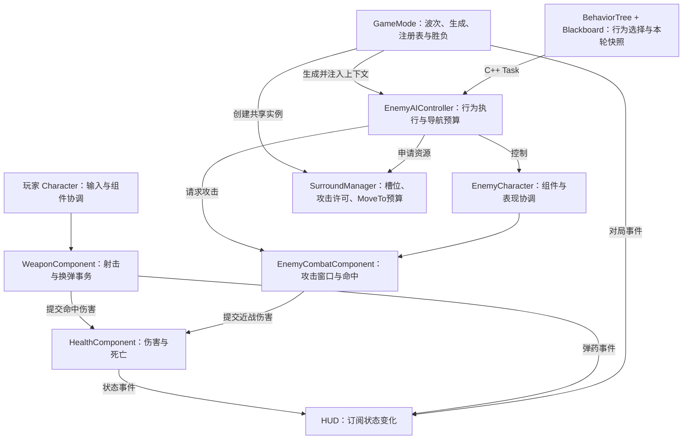
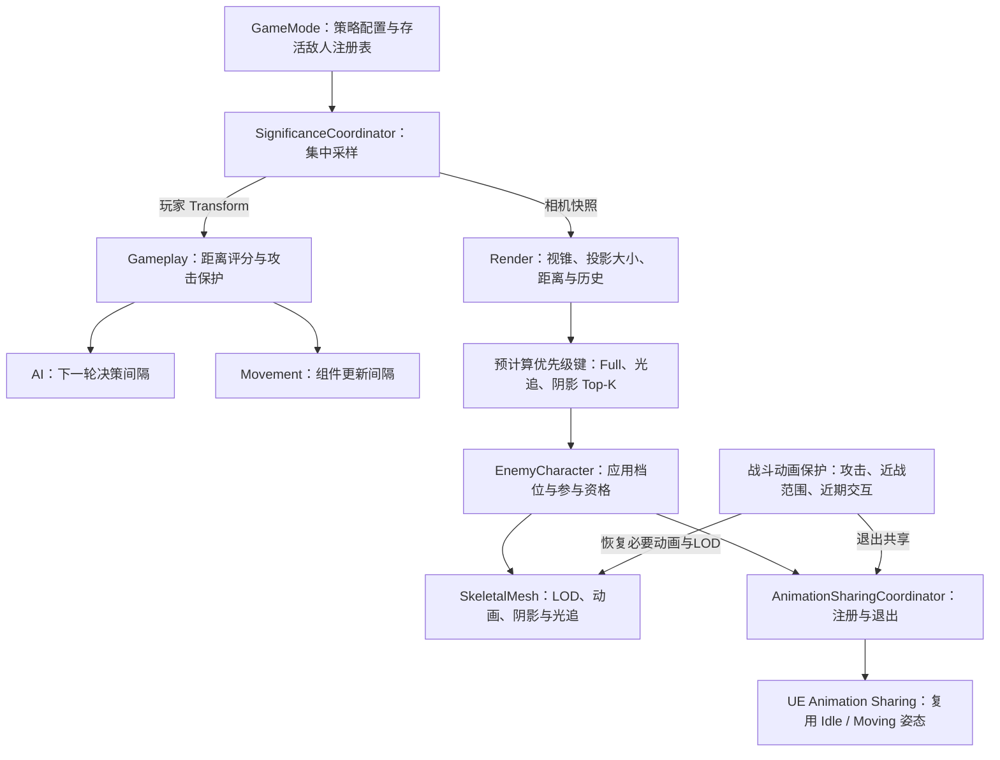

# fpstrue · UE5 C++ FPS

基于 Unreal Engine 5.5 和 C++ 的单机 PvE FPS Demo，实现射击、换弹、敌人追击与近战、群体围攻、波次结算和事件驱动 HUD 接口，并围绕 160 敌人场景开展性能分析与优化。

项目重点是完整玩法实现、多敌人更新调度，以及从实验数据追到线程依赖的性能归因。

> 本仓库提供源码、配置、测试脚本和性能记录。地图、模型、动画、音频等二进制及第三方 Content 资产不随仓库分发；还原完整关卡需要配置对应资源。

## 项目亮点

- **射击与近战的动作一致性**：换弹和攻击用动作编号、Mesh、AnimInstance 与 Montage 实例共同识别一次播放，统一处理完成、中断和超时；伤害、弹药与动作结束各有明确提交入口。真实蓝图回归覆盖普通/空仓换弹、旧通知拒绝和委托重入，避免迟到回调覆盖新状态。
- **武器配置与运行状态分离**：`WeaponConfig` 集中 25 项可调参数，首次成功装备时校验并保存完整快照，蓝图继续选择动画和音效。多件武器共享配置但不共享弹药、Timer 和动作身份，测试验证非法配置拒绝、实例快照及重新装备不补弹。
- **行为树与群体战术协作**：C++ Task 与可编辑行为树完成目标采样、分支选择和自适应等待；围攻管理器分配站位与攻击许可。MoveTo 结合去重、失败退避、帧级预算和请求身份检查，区分预算延后与不可达，避免旧完成回调干扰新请求。
- **战斗响应与表现成本分开管理**：Gameplay 按玩家距离与战斗状态调度 AI/Movement，Render 独立限制动画、LOD、阴影与光追参与；攻击、受击时恢复必要动画并退出共享。Animation Sharing 复用普通敌人的 Idle/Moving 姿态，历史重复消融分别验证移动、动画与渲染参与限制的收益。
- **预算选择与生命周期边界**：紧凑候选预计算优先级键，以严格弱序和有界 Top-K 选择替代完整排序；弱引用注册表、幂等注销与共享动画交换句柄处理共同约束清理。自动化验证 Top-K 等价性、迟滞、注销重入及附件/尸体的实际渲染资格。
- **从耗时位置追到线程依赖**：零敌人对照、Task Trace、引擎源码与查询开关干预，将一类 RT 长等待追到历史遮挡查询同步，避免把等待当成动态网格计算。查询缓冲与 GPU 画质候选按整帧、P95/P99 和成本转移取舍，保留有效组合及样条静态化方案，性能数据见下表。
- **可重复的功能与性能验证**：43 项 UE Automation 功能测试及 56 项采集配置检查通过，覆盖动作、配置、AI、生命周期和采集资源释放。性能脚本统一入口、记录参数读回与输入指纹，并区分 NullRHI 功能回归、历史消融和实景性能采集。

## 已验证的性能结果

下表来自同批启用/关闭策略的重复对照，每组各三次。时间单位为 ms；80 敌人与 160 敌人属于不同实验组。

| 场景 | 指标 | 关闭对应策略 | 启用对应策略 | 降幅 |
| --- | --- | ---: | ---: | ---: |
| 160 敌人 | AI Decision | 0.726 | 0.215 | 70.4% |
| 80 敌人 | Character Movement | 1.245 | 1.056 | 15.2% |
| 80 敌人 | Animation | 1.226 | 0.818 | 33.3% |
| 80 敌人 | GPU ShadowDepths | 1.773 | 1.052 | 40.7% |
| 80 敌人 | GPU Skinned BLAS | 0.495 | 0.199 | 59.8% |
| 80 敌人 | 总 RHI Draw Calls / 帧（阴影策略对照） | 2111.8 | 1655.0 | 21.6% |

这些结果验证了决策降频、移动分级、姿态共享和渲染参与限制的局部收益。历史实验采用简化 HUD、声音和玩家受伤的诊断口径；各项独立消融不相加为整帧收益。完整调查过程见[性能实验报告](Docs/Performance/EXPERIMENT_LOG.md)，逐组数据与原始文件对应关系见[实验附录](PERFORMANCE_EVIDENCE.md)。

另一项关键发现来自渲染线程（Render Thread，以下简写 RT）长等待：零敌人对照、Task Trace、源码和查询开关干预共同表明，一类 `WaitForGatherDynamicMeshElements` 长等待的上游是历史遮挡查询结果同步。沿这条证据链，采用查询 Buffer2 与 Lumen 反射下采样 2，在固定镜头、160 敌人三轮平衡顺序对照中得到：

| 指标 / ms | 原配置 | 组合配置 |
| --- | ---: | ---: |
| Frame | 14.955 | 14.279 |
| P95 / P99 | 16.415 / 17.254 | 15.696 / 16.409 |
| Render Thread | 14.689 | 13.160 |
| RHI Thread | 10.597 | 11.333 |
| GPU | 13.321 | 12.704 |

Frame 降低约 **4.5%**，P99 降低约 **4.9%**；RHI 耗时增加，最终依据整帧与尾帧的净收益保留组合。Buffer2 改变结果消费时机，反射下采样减少 GPU 工作，两项各自验证后再组合测试。

场景侧进一步将 **224 段轨道、222 段道砟**的变形几何烘焙为静态网格，保留碰撞、材质、LOD 与光追参与；TSR 历史缓冲比例由 200 调整为 150。方案复测如下：

| 指标 / ms | 0 敌人 | 160 敌人 |
| --- | ---: | ---: |
| Frame | 11.031 | 13.276 |
| P95 / P99 | 12.329 / 13.533 | 14.817 / 16.349 |
| Game Thread | 2.793 | 8.335 |
| Render Thread | 10.620 | 12.218 |
| RHI Thread | 7.798 | 10.123 |
| GPU | 9.710 | 11.825 |

测试条件：UE 5.5.4、1600×900、固定镜头、种子 1337，独立进程预热 20 秒、采集 180 秒，各一轮，无 Trace，玩家使用测试生命值。两组采集有效，期间 VSM 队列与纹理池超预算告警均为 0。这是指定版本的方案复测，与前表分别报告，不跨批次计算优化增幅。

## 玩法架构

全部代码位于一个 `fpstrue` Runtime 模块内，按业务职责组织目录。


```mermaid
flowchart TD
    GM[GameMode：波次、生成、注册表与胜负]
    PLAYER[玩家 Character：输入与组件协调]
    WEAPON[WeaponComponent：射击与换弹事务]
    HEALTH[HealthComponent：伤害与死亡]
    BT[BehaviorTree + Blackboard：行为选择与本轮快照]
    AI[EnemyAIController：行为执行与导航预算]
    ENEMY[EnemyCharacter：组件与表现协调]
    COMBAT[EnemyCombatComponent：攻击窗口与命中]
    GROUP[SurroundManager：槽位、攻击许可、MoveTo预算]
    HUD[HUD：订阅状态变化]
    GM -->|生成并注入上下文| AI
    BT -->|C++ Task| AI
    GM -->|创建共享实例| GROUP
    AI -->|申请资源| GROUP
    AI -->|控制| ENEMY
    AI -->|请求攻击| COMBAT
    ENEMY --> COMBAT
    PLAYER --> WEAPON
    WEAPON -->|提交命中伤害| HEALTH
    COMBAT -->|提交近战伤害| HEALTH
    HEALTH -->|状态事件| HUD
    WEAPON -->|弹药事件| HUD
    GM -->|对局事件| HUD
```

玩家和敌人各自持有生命组件，不共享血量。行为树选择移动或攻击分支，Controller 执行受预算约束的请求，CharacterMovement 执行移动；CombatComponent 执行攻击事务，SurroundManager 只协调群体资源。

GameMode 使用 `Waiting → Starting → Playing → Finished` 表达对局阶段。先校验出生点和玩家，再注入群体上下文，提交完整初始状态后才广播；重复开局和广播期间结束对局都不会重新启动生成队列。

### 射击与换弹

- 玩家输入经过角色接口交给武器；武器检查状态、射速和弹药，执行 Hitscan，再通过 UE 伤害接口交给目标的生命组件。
- `WeaponTrace` 与普通碰撞分开配置：敌人 Mesh 接收射击查询，胶囊不抢先阻挡该通道。
- 换弹使用 Ready/Firing/Reloading/Disabled 状态与独立提交入口；动画通知提交弹药，结束路径处理重复通知和委托重入，角色死亡时停止武器动作与 Timer。
- `ReloadId` 与 Mesh、AnimInstance、Montage 实例组成播放身份；手臂和枪械播放由同一事务管理。装填 Notify 校验身份后提交弹药，完成与取消统一清理，超时只解除动作锁。
- HUD 订阅生命、弹药和对局事件；C++ 提供状态变化入口，不在 UI 回调中执行伤害或弹药结算。

### 敌人追击与近战

- 行为树每轮先等待自适应间隔，再采样一次目标与距离，由 Selector 选择持续攻击、空闲、攻击/站位、包围或追击；首次等待错峰。Controller 不再运行另一套决策 Timer。
- MoveTo 先检查目标变化与失败退避，再申请全局帧级预算；现有路径由导航、PathFollowing 和 CharacterMovement 继续执行。
- 移动请求保存 RequestID 和提交版本，区分延后、不可达与已到达；围攻和追击分别维护退避。Combat 一次提供距离、攻击范围与可达性快照，正式攻击时实时复核。
- 攻击先申请群体许可，再检查停稳与朝向，由 Controller 直接调用角色持有的 CombatComponent；AnimNotifyState 开启和关闭刀刃 Sweep 窗口，单次攻击命中去重。
- 攻击阶段使用 `Idle / Windup / Active / Recovery`，只有 Active 执行伤害查询；重复打开窗口不重置刀刃历史采样，命中过的本次攻击不能重新开窗。
- 正常结束、保护 Timer 和死亡中断共用事务清理，归还许可并清除定时任务；正常结束更新冷却，中断不伪造正常完成。

默认可编辑资产位于 `/Game/FirstPerson/AI/BT_FPEnemy`、`BB_FPEnemy` 和 `BP_FPEnemyAIController`。C++ 负责采样、受预算约束的动作和自适应等待；行为树编辑器负责分支优先级与 Blackboard 条件，Controller 蓝图可以替换树。`Tools/Gameplay/CreateEnemyBehaviorTree.py` 可重建缺失资产，已有树不会被覆盖；无 Content 的源码环境保留原生默认树用于测试。

上表的 AI Decision 消融对应历史 Timer 版本，用于验证决策降频策略；行为树负责当前行为编排，场景复测单独记录版本与配置。

## 性能优化架构


```mermaid
flowchart TD
    GM[GameMode：策略配置与存活敌人注册表]
    CO[SignificanceCoordinator：集中采样]
    GM --> CO
    CO -->|玩家 Transform| GP[Gameplay：距离评分与攻击保护]
    GP --> AI[AI：下一轮决策间隔]
    GP --> MOVE[Movement：组件更新间隔]
    CO -->|相机快照| SAMPLE[Render：视锥、投影大小、距离与历史]
    SAMPLE --> SELECT[预计算优先级键：Full、光追、阴影 Top-K]
    SELECT --> APPLY[EnemyCharacter：应用档位与参与资格]
    APPLY --> MESH[SkeletalMesh：LOD、动画、阴影与光追]
    APPLY --> SHARE[AnimationSharingCoordinator：注册与退出]
    SHARE --> PLUGIN[UE Animation Sharing：复用 Idle / Moving 姿态]
    PROTECT[战斗动画保护：攻击、近战范围、近期交互]
    PROTECT -->|恢复必要动画与LOD| MESH
    PROTECT -->|退出共享| SHARE
```

### 1. 玩法分级与战斗保护

Gameplay 不读取相机可见性，玩家背后的敌人仍能追击和攻击。UE SignificanceManager 按玩家二维距离评分，角色转换为 Full/Reduced/Background 并下发 AI 与 Movement 更新节奏。

正在攻击或目标进入攻击范围时，Gameplay 保持 Full；战斗附近 AI 使用独立短间隔。攻击入口直接恢复 Movement 和必要骨骼更新配置。受击会刷新动画保护并退出共享；它不直接重启行为树。

### 2. 渲染资格与 Top-K

每轮相机信息只采样一次，敌人样本进入连续候选数组。选择阶段只比较预计算的数值键：主视锥、扩展视锥、评分、对象 ID。比较器处理非有限评分，评分完全相等时才使用 ID，避免近似相等破坏严格弱序。

Full、骨骼光追和阴影分别使用有界 Top-K 堆，替代全部候选排序。堆顶保留当前入选者中优先级最低的一项，新候选更优时替换；三次选择复用同一个内联堆。单项选择需要线性扫描和至多 `O(log K)` 的单次调整，额外选择空间为 `O(K)`。

资格仍有明确依赖：Full 从自然 Full 档位中选择；骨骼光追从最终 Full 且满足距离的对象中选择；阴影要求扩展视锥、距离和非 Background 档位。战斗动画保护独立执行，不额外分配阴影或光追名额。自然渲染档位使用升降双阈值、降档延迟与最短保持时间。

预算作用于敌人自身及其 ChildActor 组件拥有的 Mesh，保留资产原本关闭的阴影/光追标志。普通 Attach 的独立 Actor 不自动接管；动态增删受管组件后调用 `RefreshRenderBudgetMeshes`，日常分配只遍历缓存。尸体退出存活注册表时撤销受管 Mesh 的阴影、光追资格，保留普通显示与布娃娃表现。

CSV 保留 `ShadowCasters`、`RayTracingVisible` 的主 Mesh 统计口径，另记录 `ManagedMeshes`、`ShadowMeshes`、`RayTracingMeshes` 与对应的 `ShadowOwners`、`RayTracingOwners`。这些值从实际组件属性读回：预算按敌人计，附件可能使组件数多于敌人数；它们不是全场景 GPU 图元数。

### 3. 动画共享与生命周期

非 Full Render、无战斗保护且存活的普通敌人，可按骨架资格进入 Idle/Moving 共享池。攻击、受击和死亡时退出，恢复独立动画；每个敌人的 AI、移动、血量和伤害判定仍独立维护。

GameMode 用弱引用集合管理存活敌人，死亡、销毁和 EndPlay 共用幂等注销入口，集中更新前清除失效条目。Animation Sharing 区分待交付和已注册句柄；失败注册释放待交付记录，允许重试。

UE 插件注销采用 `RemoveAtSwap`，会同步通知被交换角色的新句柄。回调只保存本地句柄，实际注销在回调外完成，避免重入正在调整的插件数组；退出共享时恢复骨骼 LOD 控制。

### 4. 配置与实验控制

- 波次配置由 `WaveConfiguration` 数据资产提供；近战配置由 `CombatConfiguration` 数据资产提供。选中资产后整组使用该来源，未配置资产的旧蓝图继续兼容，不逐字段混用。
- 武器的 `WeaponConfiguration` 集中管理射速、伤害、弹药、散布、后坐力及换弹兜底等 25 项参数。首次成功装备时校验并复制完整配置；同一武器卸下再装备保留快照与剩余弹药，不补满。表现资源仍由蓝图选择。
- `Tools/Gameplay/MigrateGameplayConfiguration.py` 和 `MigrateWeaponConfiguration.py` 提供已有配置的迁移与校验。完整开发环境保留迁移后的绑定，二进制资产仍遵守仓库的 Content 不分发规则；新建配置及旧版本迁移步骤见配置说明。
- AI 更新间隔、移动参数和渲染预算保留现有蓝图可编辑属性，不再复制进另一套 JSON。
- 共享动画默认软引用放在项目 INI，组件蓝图可以覆盖。
- JSON 只保存实验预设，优先级为显式命令行参数 > JSON > 脚本默认值。
- Runner 负责规模准备、预热、CSV/Trace 采集和有效性检查；脚本保存最终参数、来源和输入指纹。
- 运行时诊断参数与业务埋点声明集中在 `Runtime/`；`Testing/Benchmarks/` 负责采集阶段与资源管理。采集启动、有效性检查及写盘由 CoreTicker 驱动，World 暂停时也能处理超时和释放资源。

配置入口与使用方式见 [CONFIGURATION.md](Docs/CONFIGURATION.md)。

## 实验进展与证据

| 阶段 | 解决的问题 | 结果与决策 |
| --- | --- | --- |
| 规模测试与调用链分析 | 敌人增加后，哪些工作随规模增长 | 优先定位移动与动画，区分局部计算和任务等待 |
| 消费者重复对照 | 哪些策略确实减少了工作 | 确认决策、移动、动画共享、阴影与骨骼 RT 的局部收益 |
| 零敌人与任务依赖追踪 | 敌人成本下降后，RT 为什么仍等待 | 追到历史遮挡查询结果同步，转向场景渲染与同步链 |
| 查询策略和 GPU 工作分解 | 缩短等待能否改善整帧 | HZB 因整帧回退未采用；Buffer2 与反射下采样组合改善 Frame/P95/P99 |
| 零敌人场景成本优化 | 场景自身的实例准备与后处理成本 | 静态样条烘焙、TSR History 150，并完成 0/160 敌人长采集 |

- [完整性能实验报告](Docs/Performance/EXPERIMENT_LOG.md)：按调查阶段串联问题、实验、发现与后续决策。
- [性能实验附录](PERFORMANCE_EVIDENCE.md)：逐组数据、异常样本、Trace 事件与本机原始文件对应关系。
- [Unreal Insights 截图](PerformanceEvidence/UnrealInsights_160Enemies.png)：历史 160 敌人样本，仅对应当次采集。


完整 CSV、日志与 Trace 保存在本机 `Saved/Profiling/`，公开记录保留摘要和文件索引。失败实验及成本转移同样保留，用于解释策略取舍。

## 源码导航

阅读时先沿两条主线展开：

- **玩法主线**：GameMode 装配与生成 → BehaviorTree 选择行为 → AIController 执行移动或攻击 → CombatComponent 管理攻击窗口；需要群体许可和站位时再读 SurroundManager。
- **性能主线**：SignificanceCoordinator 采样 → Top-K 分配 → EnemyCharacter 应用到组件 → AnimationSharingCoordinator 维护共享注册。

主要实现文件按调用流程排列：生命周期入口在前，业务入口和相邻辅助函数成组，结束与公共清理集中放置。EnemyCharacter 内依次是状态查询、战斗桥接、受击死亡、Gameplay 分级、Render 分级和动画共享；诊断开关放在末尾。预算统计与选择分开，阅读选择逻辑时不必穿过 CSV 计数代码。

攻击判断和启动由 AIController 直接调用角色持有的 CombatComponent；攻击窗口 Notify 与 CombatComponent 放在同一组头文件/实现文件中，形成 `AI/Notify → CombatComponent → 攻击事务与窗口检测`。蓝图通过 `OnAttackPlaybackRequested(AttackId)` 接入播放，原生 Montage 实例回调结束事务。武器与攻击共用 `FFPActionPlayback` 身份校验，玩家、武器和 Health 各自保留独立业务职责。

| 功能 | 主要实现 |
| --- | --- |
| 玩家控制 | [Character](Source/fpstrue/Characters/Player/fpstrueCharacter.cpp) |
| 武器、射击与换弹 | [WeaponComponent](Source/fpstrue/Weapons/fpstrueWeaponComponent.cpp) |
| 通用伤害与生命 | [HealthComponent](Source/fpstrue/Characters/Shared/fpstrueHealthComponent.cpp) |
| 动作播放身份 | [ActionPlayback](Source/fpstrue/Characters/Shared/fpstrueActionPlayback.h) |
| 敌人 AI 与路径请求 | [EnemyAIController](Source/fpstrue/Characters/Enemies/AI/fpstrueEnemyAIController.cpp) |
| 行为树任务与默认树 | [BehaviorTree](Source/fpstrue/Characters/Enemies/AI/fpstrueEnemyBehaviorTree.cpp) |
| 攻击事务与命中窗口 | [EnemyCombatComponent](Source/fpstrue/Characters/Enemies/fpstrueEnemyCombatComponent.cpp) |
| 围攻槽位与共享预算 | [SurroundManager](Source/fpstrue/Characters/Enemies/AI/fpstrueSurroundManager.cpp) |
| 角色表现与性能档位 | [EnemyCharacter](Source/fpstrue/Characters/Enemies/fpstrueEnemyCharacter.cpp) |
| Top-K 与预算分配 | [SignificanceCoordinator](Source/fpstrue/Characters/Enemies/Performance/fpstrueEnemySignificanceCoordinator.cpp)、[优先级键与堆](Source/fpstrue/Characters/Enemies/Performance/fpstrueEnemySignificance.h) |
| 动画共享接入 | [AnimationSharingCoordinator](Source/fpstrue/Characters/Enemies/Performance/fpstrueEnemyAnimationSharingCoordinator.cpp) |
| 波次、注册表与胜负 | [GameMode](Source/fpstrue/Game/fpstrueGameMode.cpp) |
| 玩法配置资产 | [WaveConfiguration](Source/fpstrue/Game/fpstrueWaveConfiguration.h)、[EnemyCombatConfig](Source/fpstrue/Characters/Enemies/fpstrueEnemyCombatConfig.h)、[WeaponConfig](Source/fpstrue/Weapons/fpstrueWeaponConfig.h) |
| 测试与性能采集 | [Automation](Source/fpstrue/Testing/Automation/)、[Benchmarks](Source/fpstrue/Testing/Benchmarks/)、[Tools](Tools/) |

## 构建与验证

环境：Unreal Engine 5.5、Visual Studio 2022、“使用 C++ 的游戏开发”工作负载及 Windows SDK。生成 Visual Studio 项目文件后，编译 `fpstrueEditor` 的 Development Editor 配置。

完整开发环境的当前地图入口为 `/Game/PerformanceCandidates/SplineBake_Tracks20260928/Demonstration_Baked`，由关卡或 UI 调用 `StartGameMode` 开始正式波次。公开源码需配置有使用权限的地图、角色蓝图与资源引用，接线约定见[配置说明](Docs/CONFIGURATION.md)。

UE Automation 测试组为 `fpstrue.`，可在 Session Frontend → Automation 中运行，或使用：

```powershell
& "<UE5.5目录>\Engine\Binaries\Win64\UnrealEditor-Cmd.exe" "<项目目录>\fpstrue.uproject" /Engine/Maps/Entry -Unattended -NullRHI -NoSplash -NoSound -ddc=NoZenLocalFallback '-LocalDataCachePath=<项目目录>\Saved\LocalDDC' '-ExecCmds=Automation RunTests fpstrue.' '-TestExit=Automation Test Queue Empty' '-ReportExportPath=<项目目录>\Saved\Automation\Regression' -Log
```

自动化测试覆盖行为树与运行生命周期、开局回调重入、配置选源、攻击阶段与清理、射击换弹、严格弱序、Top-K 等价性、共享注销、档位迟滞，以及附件和尸体的渲染资格。全套测试包含真实蓝图播放链，运行时需准备对应 Content；NullRHI 用于功能与组件属性回归，性能数据来自独立实景采集。

完整开发环境验证：Development Editor 与 Development Game 编译通过；**43 项 UE 自动化测试全部通过，0 失败、0 未运行**，其中 17 项包含测试夹具或故障注入警告。回归覆盖武器配置合法性、独立快照与重新装备、真实蓝图换弹与攻击播放、旧回调拒绝、停止重入、MoveTo 请求归属、生命值通知队列、受击解除 Tick 冷却、CSV 迟到启动与暂停超时。测试摘要见[验证记录](Docs/Testing/VALIDATION.md)。

实际关卡的 160 敌人功能烟测通过，组件属性读回为 5 个投影 Mesh、12 个光追 Mesh，与当次预算一致。生成队列支持换点重试；NullRHI 烟测核对玩法流程与预算下发，实景采集记录 RT/RHI/GPU 与尾帧。

另用 32 敌人检查预算边界：Full 名额为 0 时，Full 与骨骼光追参与数均为 0；关闭渲染分档后，同一配置得到 32 个 Full，独立阴影/光追预算仍为 5/12。日志分别为 `Saved/Logs/EquivalentCleanupZeroFull.log` 与 `Saved/Logs/EquivalentCleanupTieringOff.log`。

性能测试统一使用 `Tools/Performance/RunRenderCostMatrix.ps1`：JSON 保存采集预设，`RenderCostCases.psd1` 集中定义默认值、实验 CVar 和读回校验。配置脚本 **56 项检查通过**，无须启动 UE：

```powershell
.\Tools\Performance\TestRenderCostConfig.ps1
.\Tools\Performance\RunRenderCostMatrix.ps1 -ConfigFile .\Tools\Performance\ExperimentProfiles\baseline160.json -ValidateOnly
.\Tools\Performance\RunRenderCostMatrix.ps1 -ConfigFile .\Tools\Performance\ExperimentProfiles\scene-acceptance.json -ValidateOnly
```

正式采集前按[配置说明](Docs/CONFIGURATION.md)检查引擎路径、地图和生效参数。固定场景成本采集与正常生命条件下的玩法基线分别记录；Top-K 的算法验证不代替实景性能 A/B。

## 目录结构

```text
Config/                     引擎、输入、碰撞与默认资源配置
Source/fpstrue/
  Game/                     波次、生成、注册表与结算
  Characters/
    Player/                 玩家控制
    Enemies/                敌人角色、近战组件与战斗配置
      AI/                   Controller、行为树、导航与群体战术资源
      Performance/          Gameplay/Render 分级、Top-K 与动画共享接入
    Shared/                 生命组件、播放身份与碰撞通道
  Weapons/                  武器配置、射击、换弹、拾取与动画通知
  Runtime/                  诊断参数快照与业务埋点声明
  Testing/
    Automation/             玩法、算法与生命周期回归
    Benchmarks/             采集阶段、资源管理与产物校验
Tools/                      开发与测试工具（见 Tools/README.md）
  Gameplay/                 行为树生成/校验与玩法配置迁移
  Assets/                   网格、LOD、Nanite、纹理与样条资产处理
  Performance/              性能采集、Trace 导出、分析与配置校验
    ExperimentProfiles/     实验定义与采集预设
    Charts/                 实验图表生成
  LegacyPerformance/        历史实验采集与汇总
Docs/Performance/           分阶段实验记录
PerformanceEvidence/        可公开的性能截图
```
